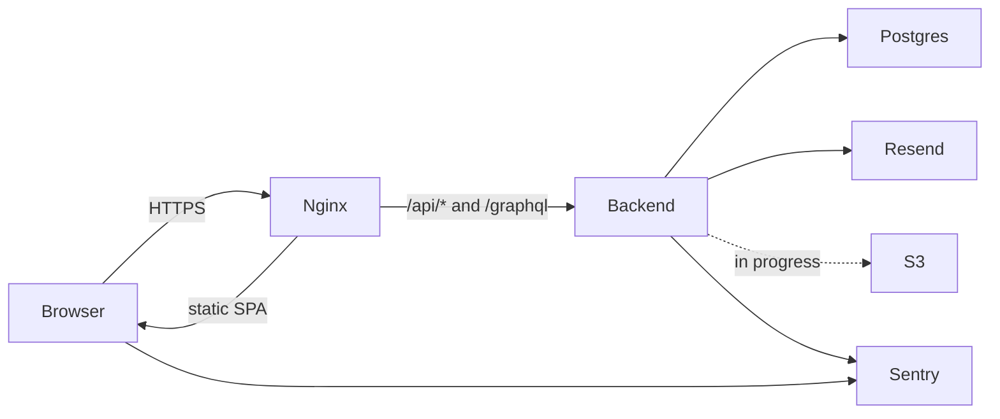

## Files to create

- [`healthy-paws-wrapper/BUSINESS-LOGIC.md`](healthy-paws-wrapper/BUSINESS-LOGIC.md) — domain rules + state machines + sequence diagrams for the flows a user/evaluator cares about.
- [`healthy-paws-wrapper/ARCHITECTURE.md`](healthy-paws-wrapper/ARCHITECTURE.md) — tech stack + request lifecycle + DB ERD + GraphQL design + deployment topology, with explicit "in progress" callouts for the deferred AWS work.

Both link to each other and to the existing plans in `healthy-paws-wrapper/.cursor/plans/`.

---

## `BUSINESS-LOGIC.md` outline

1. **Who uses the app** — owners and doctors only (DB `CHECK (role IN ('owner','doctor'))` in [`healthy-paws-service/database.sql`](healthy-paws-service/database.sql); no admin role). One paragraph each.

2. **Account lifecycle** — registration → email verification → login (incl. the F-16 "EMAIL_NOT_VERIFIED 403 + resend" path), password reset, logout. Includes the enumeration-safety rules (silent reset, generic resend), rate limits, and JWT-in-httpOnly-cookie session model.
   - **State diagram**: `User.email_verified` and email-verification-token lifecycle (issued → consumed/superseded/expired).
   - **State diagram**: password reset token lifecycle.
   - **Sequence diagram**: "owner registers → verifies email → logs in" end-to-end.
   - **Sequence diagram**: F-16 unverified login + resend.

3. **Pets and owners** — owner can only see/edit their own profile and pets (`verifyOwnerOwnership` / `verifyPetOwnership` in [`healthy-paws-service/src/core/utils/authorization.utils.ts`](healthy-paws-service/src/core/utils/authorization.utils.ts)); one-condition-per-pet uniqueness on `Health_Records_*`.

4. **Doctors, specializations, services, availability**
   - Doctor list returns only doctors with at least one specialization link.
   - Doctors maintain their own profile, specialization links, per-service prices, and availability slots; mutations gated by `verifyDoctorOwnership` (`doctorId === user.id`).
   - Composite-FK rule on `Doctor_Service_Pricing` — a price row can only exist where the doctor–specialization and specialization–service links both exist.

5. **Appointment booking and lifecycle** — the heart of the app.
   - **State diagram** of `AppointmentStatus` (`Pending → Confirmed → (Upcoming derived) → Start → Completed`; plus `Denied` / `Cancelled` branches) — note that the DB enforces the *set* of valid states via the enum, and the app decides transitions.
   - **Sequence diagram** "Owner books a slot": pet-ownership check → `DELETE FROM Availabilities` for the exact `(doctor_id, datetime)` → insert `Pending` appointment, with 409/400 paths for taken slots.
   - **Sequence diagram** "Doctor confirms / denies pending" → status `Confirmed` (or `Denied`, which re-inserts the availability slot).
   - **Sequence diagram** "Doctor runs consultation": opens `/appointment-details/:id`, edits patient/clinical fields, syncs `Health_Records_Lifelong` / `Health_Records_Active`, saves with `status: Completed`.
   - Display rule: `Confirmed` is rendered as `Upcoming` when start is ≤2 hours away (frontend `getAppointmentDisplayStatus`).

6. **"Doctor can see a patient only after a completed consultation"** (the user's headline example) — dedicated section.
   - The rule is enforced *together* by:
     - Backend `getPatientsByDoctor` selecting `DISTINCT pets` joined to appointments `WHERE doctor_id = $1 AND status = 'Completed'` ([`healthy-paws-service/src/features/doctors/doctors.loaders.ts`](healthy-paws-service/src/features/doctors/doctors.loaders.ts)).
     - Frontend `DoctorDashboardPage` further filtering `doctor.patients` to those with at least one local appointment whose `status === "Completed"` ([`healty-paws-frontend/src/pages/dashboard/doctor/DoctorDashboardPage.tsx`](healty-paws-frontend/src/pages/dashboard/doctor/DoctorDashboardPage.tsx)).
   - **Sequence diagram** "Doctor opens My Patients tab" showing both layers.
   - **Caveat to document honestly**: once a pet is reachable via `Doctor.patients`, the nested `Pet.appointments` field returns *all* appointments for that pet (not scoped to this doctor). Flagged so the evaluator sees the limitation.

7. **Audit trail** — append-only `AuditEvents` writes for login (success/failure/denied), logout, password reset request/complete, email verify request/complete, and every GraphQL mutation outcome (`mutation.success` / `mutation.failure` / `authz.deny`). Mentions outcomes CHECK constraint and that queries are not audited.

8. **What's not yet wired up (business-visible)** — short list crossreferenced to `ARCHITECTURE.md`:
   - **Avatar upload** — currently a `localStorage` data URL keyed per user in `AvatarImage` / `Header`; persistent S3-backed upload is *in progress* (s05/s10 in the simple AWS deploy plan).
   - **Public hosting** — app currently runs only on `localhost`; production hosting (EC2 + Cloudflare DNS/TLS + Resend prod domain) is *in progress*.

---

## `ARCHITECTURE.md` outline

1. **One-page system overview** with a Mermaid component diagram:

Plus a one-paragraph summary per box and a pointer to `BUSINESS-LOGIC.md`.

2. **Repository layout** — three sibling repos under `Project/`:
   - [`healthy-paws-wrapper/`](healthy-paws-wrapper/) — Docker Compose, nginx config, plans, this doc.
   - [`healthy-paws-service/`](healthy-paws-service/) — Node/Express/Apollo backend.
   - [`healty-paws-frontend/`](healty-paws-frontend/) — React/Vite SPA.
   Note that submodules were removed; clone all three side by side.

3. **Tech stack** — three short tables grouped by tier (frontend / backend / infra). Source: `package.json` in each repo + `docker-compose.yml`.

4. **Backend architecture** ([`healthy-paws-service/src/app.ts`](healthy-paws-service/src/app.ts) as the entry point).
   - Folder convention: `src/features/<domain>/{routes,controller,service,repository,resolvers,loaders}.ts`; shared concerns under `src/core/` and `src/schema/`.
   - **Request lifecycle diagram** (Mermaid sequence) showing the middleware order: `trust proxy → helmet → cors → cookieParser → bodyParser → passport.initialize → auditContextMiddleware → route-specific rate limiter → passport JWT (cookie extractor) → Apollo / REST handler → globalErrorHandler → Sentry`.
   - REST surface table — every `/api/auth/*` route with its rate limiter ([`healthy-paws-service/src/features/authentication/authentication.routes.ts`](healthy-paws-service/src/features/authentication/authentication.routes.ts), `registration.routes.ts`, `email-verification.routes.ts`).
   - **Auth model**: JWT signed in `authentication.service.ts`, payload `{ id, email, role }`, transported via `accessToken` httpOnly cookie (`SameSite=strict`, `Secure` in prod), verified by `passport-jwt` cookie extractor in [`passport-config.ts`](healthy-paws-service/src/core/middleware/passport-config.ts). `SafeUserRecord` pattern explained.
   - **Mailer**: [`src/core/mailer.ts`](healthy-paws-service/src/core/mailer.ts) — Resend SMTP when `RESEND_API_KEY` set, `streamTransport` stdout fallback for dev; lazy singleton.
   - **Observability**: Sentry init in `src/core/observability/sentry.ts`, Apollo `sentryPlugin`, global error handler. Audit writes in `auditMutations` plugin + REST controllers.

5. **GraphQL architecture**.
   - Schema source [`src/schema/typeDefs.graphql`](healthy-paws-service/src/schema/typeDefs.graphql), resolver merge in [`src/schema/resolvers.ts`](healthy-paws-service/src/schema/resolvers.ts).
   - `wrapResolvers` + `requireAuth` rule: every Query and Mutation requires `context.user`; mutations also gated earlier by `requireAuthMutations` plugin (returns HTTP 401).
   - DataLoader pattern explained with one concrete example (`doctorById` batching `WHERE id = ANY($1)`).
   - **Per-request context diagram** showing `{ db, user, doctorLoaders, petLoaders, ownerLoaders, audit }`.
   - graphql-armor limits (depth 8, cost 5000, aliases 15, directives 50, tokens 1000), introspection off in prod.
   - GraphQL operation inventory: full lists of Queries and Mutations.

6. **Frontend architecture** ([`healty-paws-frontend/src/App.tsx`](healty-paws-frontend/src/App.tsx) as entry).
   - React 19 + Vite 7 + React Router 7 + Apollo Client 4; no Redux/Zustand (Apollo cache + one `AuthenticationContext`).
   - Folder convention: `pages/`, `components/{ui,features}/`, `lib/graphql/{appointments,doctors,owner,patients}/` (feature-named hooks), `router/{PublicRoute,ProtectedRoute}/`, `context/AuthenticationContext.tsx`.
   - **Routing diagram** (Mermaid flowchart) of public vs `PublicRoute` vs `ProtectedRoute(allowedRoles)` segments, with role-based redirect after login.
   - Apollo link chain (`errorLink → retryLink → persistedQueriesLink → httpLink`), `credentials: "include"` for cookie auth, `clearStore` + redirect on `UNAUTHENTICATED` / HTTP 401.
   - Cache typePolicies (`Doctor.availabilities` replace-merge, `Availability` keyed by `id`); per-hook `fetchPolicy` overrides (`network-only` on user-owned reads, `cache-first` on doctor list).
   - GraphQL codegen — `src/generated/` from `operations.graphql`.
   - Forms (react-hook-form + zod), styling (plain CSS + `globals.css` tokens), error handling (inline + Sentry).

7. **Frontend ↔ Backend communication** — single Mermaid sequence diagram covering both paths:
   - REST: `LoginPage` → axios `POST /api/auth/login` with `withCredentials` → Set-Cookie `accessToken` → role-based redirect.
   - GraphQL: `useOwner(id)` → Apollo `HttpLink` → `POST /graphql` with cookie → resolvers → loaders → Postgres → JSON back → Apollo cache.
   - Auth-recovery: GraphQL `UNAUTHENTICATED` → Apollo error link → REST `POST /api/auth/logout` + full reload to `/auth/login`.

8. **Database** ([`healthy-paws-service/database.sql`](healthy-paws-service/database.sql) + `migrations/`).
   - **ERD** (Mermaid `erDiagram`) covering `Users`, `Owners`, `Doctors`, `Pets`, `Appointments`, `Availabilities`, `Specializations`, `Services`, `Doctor_Specializations`, `Specialization_Services`, `Doctor_Service_Pricing`, `Health_Records_Lifelong`, `Health_Records_Active`, `PasswordResetTokens`, `EmailVerificationTokens`, `AuditEvents`. Shared-PK 1:1 relationship between `Users` ↔ `Owners`/`Doctors` called out.
   - Per-table summary table (PK, FKs, key uniques/checks, introducing migration).
   - **Constraints that encode business rules**: cascade deletes, the partial unique index `unq_doctor_appointment_active` (no double-booking on non-terminal statuses), `unq_doctor_availability`, role check, etc.
   - Migration strategy: node-pg-migrate, `.pgmigraterc.json`, `0001_baseline` + `0002_audit_events` + `0003_email_verification`, forward-only convention, `DATABASE_URL` for the CLI.

9. **Local development & Docker Compose** — what [`healthy-paws-wrapper/docker-compose.yml`](healthy-paws-wrapper/docker-compose.yml) brings up (`postgres`, `migrate`, `service`, `frontend`, `nginx`); the sibling-repo `../` paths; required `.env` files in `healthy-paws-wrapper/` and `healthy-paws-service/`; how the dev-mode mailer stdout fallback works.

10. **Production deployment topology** — restate the simple-AWS-deploy "where each piece physically lives" table verbatim, with implementation status badges. The next subsection enumerates **In progress** items.

11. **In progress (from [`healthy-paws-wrapper/.cursor/plans/simple_aws_deploy_b6a51c00.plan.md`](healthy-paws-wrapper/.cursor/plans/simple_aws_deploy_b6a51c00.plan.md))** — each item has a one-line scope + the plan step that owns it:
    - **In progress** — Avatar upload via S3 (s05 backend storage module + s10 bucket + s11 IAM role + s17 frontend wiring). Currently `localStorage` data URLs.
    - **In progress** — Resend account + verified sending domain (s08). Currently dev stdout fallback when `RESEND_API_KEY` is unset.
    - **In progress** — Domain purchase + Cloudflare DNS zone (s09).
    - **In progress** — AWS account hardening + IAM bootstrap (s06, s07).
    - **In progress** — EC2 t3.micro provisioning + security group (s12, s13).
    - **In progress** — Cloudflare Origin Cert + DNS records pointing at EC2 (s14, s15).
    - **In progress** — First production deploy: backend image build + `docker compose -f docker-compose.prod.yml up -d` on EC2 (s16, s19); SPA `scp dist/` to `/opt/healthy-paws/nginx/spa/` (s17, F2).
    - **In progress** — Post-deploy smoke tests + log/backup checklist (s20).
    Each item links to the corresponding step ID for easy navigation.

12. **Future / optional (out of scope)** — one paragraph pointing at [`healthy-paws-wrapper/.cursor/plans/advanced_extras_5e44ab10.plan.md`](healthy-paws-wrapper/.cursor/plans/advanced_extras_5e44ab10.plan.md) for the EC2/Cloudflare-Pages split, Terraform IaC, CI/CD, etc. — clearly *not* needed for the uni submission.

---

## Tone & format conventions for both docs

- All diagrams are Mermaid fenced code blocks, valid syntax (camelCase node IDs, quoted labels with parens, no `style` / `classDef` directives so dark mode renders correctly).
- File and folder references use markdown links with relative paths from `healthy-paws-wrapper/`.
- "In progress" items use a uniform `**In progress** — ...` prefix so they are visually scannable.
- No emojis; no AWS-deploy step is re-explained in detail — link to the plan instead, to avoid drift.