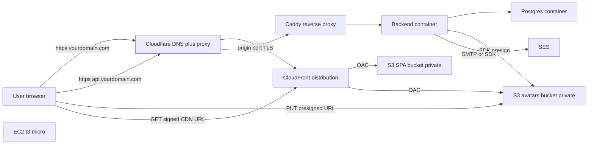
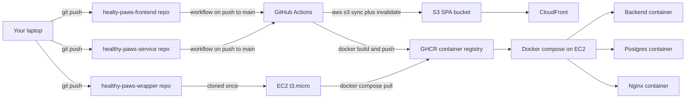

# AWS free-tier deployment plan

## Target topology



Cloudflare sits in proxy mode in front of the EC2 origin and the CloudFront distribution. It contributes free Universal SSL on the public edge, a free 15-year Origin Certificate to the EC2 box, free DNS, and a free WAF/DDoS layer — all of which would otherwise need separate AWS setup.

---

## Phase 0 — Pre-deploy hardening (answers Q5)

These are the things that are cheap to fix now and painful to fix in production. Roughly two evenings of work.

**Must do before any public traffic:**

- **Trust the reverse proxy.** Add `app.set("trust proxy", 1);` in [healthy-paws-service/src/app.ts](healthy-paws-service/src/app.ts) just after `const app = express();`. Without this, `req.ip` is the Cloudflare IP and `express-rate-limit` will bucket every request together.
- **Healthcheck endpoint.** `GET /healthz` in [src/app.ts](healthy-paws-service/src/app.ts) that runs `SELECT 1` against the pool with a 1-second timeout. Wire to compose `healthcheck:` on the backend service and `pg_isready` on the db service.
- **Compose restart + log rotation + resource limits.** Update [healthy-paws-wrapper/docker-compose.yml](healthy-paws-wrapper/docker-compose.yml) per service: `restart: unless-stopped`, `logging: { driver: json-file, options: { max-size: 10m, max-file: 3 } }`, `deploy.resources.limits.memory: 384m` for the backend, 256m for Caddy, leave Postgres uncapped on a 1 GB t3.micro.
- **CORS allowlist for prod.** `ALLOWED_ORIGINS=https://yourdomain.com` in the EC2 `.env`. The code in [src/app.ts](healthy-paws-service/src/app.ts) already reads from env.
- **CSP origin for CDN.** In [healthy-paws-wrapper/nginx/nginx.conf](healthy-paws-wrapper/nginx/nginx.conf) (or its Caddy replacement), add the CloudFront domain to `img-src` so avatars render.
- **NODE_ENV=production** in EC2 `.env` so `secure: true` cookies kick in and Apollo introspection is off.
- **Pool sizing.** [src/core/config/db.ts](healthy-paws-service/src/core/config/db.ts) currently has no `max`. Set `max: 8` (a t3.micro Postgres handles ~20 connections comfortably; leave headroom for psql/backup tasks).
- **SSH + firewall.** UFW only on 22/80/443. Disable password auth in `/etc/ssh/sshd_config` (`PasswordAuthentication no`). Use an EC2 key pair.
- **Graceful shutdown.** `process.on("SIGTERM", () => server.close(...))` in [src/app.ts](healthy-paws-service/src/app.ts) so `docker compose down` doesn't drop in-flight requests.

**Strongly recommended within the first week:**

- **Email verification (F-16)** — without it, anybody can register fake accounts. Already outlined in [the existing roadmap section 3](.cursor/plans/security_and_ops_roadmap_65e3f986.plan.md).
- **Audit log (F-26)** — at minimum capture `login.success`, `login.failure`, `password.reset.requested` so you have forensics.
- **Nightly `pg_dump` to S3** — single shell script + cron entry on EC2. Recovery from a botched migration or accidental DELETE is otherwise impossible.
- **`node-pg-migrate`** — before your second schema change. The current [database.sql](healthy-paws-service/database.sql) `docker-entrypoint-initdb.d` only runs on a fresh volume.
- **Sentry** (free dev plan, 5k events/mo) wired into both the frontend `ApolloProviderWrapper` and the backend's `globalErrorHandler`.
- **SES DNS records** — SPF, DKIM, and DMARC (records covered in Phase 3 below) so Gmail/Outlook actually deliver your password-reset and verification mails.

---

## Phase 1 — Domain and DNS

- **Register the domain** at the cheapest registrar that suits you. Cloudflare Registrar charges wholesale (~$10/yr for `.com`); Namecheap is similar with promo first year. Route 53 is fine but ~$13/yr and the registrar UX is the worst of the three. Domain registration is the only line item that is never free.
- **Move DNS to Cloudflare** (free) even if you registered elsewhere. You get:
  - Free Universal SSL between user and Cloudflare edge.
  - Free DDoS + WAF + bot protection.
  - Free CNAME flattening so `yourdomain.com` apex can point at CloudFront.
  - Free analytics.
- **Records to create:**
  - `yourdomain.com` → CNAME (flattened) to the CloudFront distribution.
  - `www.yourdomain.com` → CNAME to the CloudFront distribution.
  - `api.yourdomain.com` → A record to the EC2 Elastic IP, **proxied** through Cloudflare.

---

## Phase 2 — S3 + CloudFront for the SPA and avatars (answers Q3)

### SPA hosting

- One S3 bucket `healthy-paws-spa-prod`, blocked from public access.
- One CloudFront distribution with **OAC (Origin Access Control)** pointing at the bucket, default root object `index.html`, custom error page mapping 403/404 → `/index.html` so React Router deep links work.
- Build pipeline: `npm run build` in [healty-paws-frontend](healty-paws-frontend) (sourcemaps already `hidden` from prior work), then `aws s3 sync dist/ s3://healthy-paws-spa-prod/ --delete --cache-control "public,max-age=31536000,immutable"`, then `aws s3 cp dist/index.html s3://.../index.html --cache-control "public,max-age=60"` (short TTL on the HTML shell so deploys propagate, long TTL on the hashed assets).
- Invalidate `/index.html` on each deploy.

### Avatar uploads (replaces the base64 localStorage hack)

Backend changes in [healthy-paws-service](healthy-paws-service):

- New module `src/features/storage/storage.service.ts` with an `S3Client` (region from env, IAM role from EC2 instance profile — never long-lived keys).
- New mutations in [src/schema/typeDefs.graphql](healthy-paws-service/src/schema/typeDefs.graphql):
  ```graphql
  type PresignedUpload { uploadUrl: String!, key: String!, expiresAt: String! }
  extend type Mutation {
    requestProfileImageUpload(contentType: String!, sizeBytes: Int!): PresignedUpload!
    confirmProfileImage(key: String!): Owner!
  }
  extend type Owner { profileImageUrl: String }
  ```
- Resolvers in [src/features/owners/owners.resolvers.ts](healthy-paws-service/src/features/owners/owners.resolvers.ts):
  - `requestProfileImageUpload` enforces `contentType ∈ {image/jpeg, image/png, image/webp}` and `sizeBytes ≤ 2_097_152`. Returns a presigned PUT URL with both conditions baked in (15-min TTL). Key pattern `avatars/{ownerId}/{uuid}.{ext}`.
  - `confirmProfileImage` does `HeadObject` to confirm the upload happened, validates returned ContentType against the allowlist, and persists the key on the owner row.
  - `Owner.profileImageUrl` field resolver builds `https://cdn.yourdomain.com/{key}` from the stored key.
- Schema migration: `ALTER TABLE owners ADD COLUMN profile_image_key TEXT;` (track via `node-pg-migrate` once adopted).
- The existing `requireAuthMutations` plugin already gates these mutations; cross-role authz check inside `confirmProfileImage` verifies `ctx.user.id === ownerId`.

Frontend changes in [healty-paws-frontend](healty-paws-frontend):

- Delete the base64-in-localStorage code path in `src/components/ui/AvatarImage` (called out as `[L]` in the roadmap).
- New upload flow: `<input type="file" accept="image/*">` → call `requestProfileImageUpload` → `fetch(uploadUrl, { method: "PUT", body: file })` → call `confirmProfileImage`.
- Display via ``.

### Bucket + CloudFront wiring

- `healthy-paws-avatars-prod` private bucket; lifecycle rule deleting `avatars/orphans/*` after 7 days (for failed confirms).
- CloudFront distribution with OAC to that bucket, alternate domain `cdn.yourdomain.com`, ACM cert via `us-east-1`, viewer protocol policy HTTPS-only, allowed methods GET/HEAD only (uploads go direct to S3, not through the CDN).
- Cache policy: 24h TTL, ignore query strings, cache by `Accept` only.
- Free tier covers this easily: 5 GB storage, 20k GET / 2k PUT for 12 months on S3; CloudFront is **always-free** 1 TB out + 10M requests per month.

---

## Phase 3 — Host and deploy the three tiers (answers Q4)

### 3.1 What runs where, at a glance

Each tier has a different home, build path, and update cadence. The current [healthy-paws-wrapper/docker-compose.yml](healthy-paws-wrapper/docker-compose.yml) is a **dev compose** — it builds from source, mounts the workspace, and runs the frontend as a vite dev server. **It is not what runs in production.** You'll keep that file for local dev and add a separate `docker-compose.prod.yml` for the box.

| Tier | Lives on | Built where | Deployed by | Runs as |
| --- | --- | --- | --- | --- |
| **Frontend** (React SPA) | S3 bucket + CloudFront | GitHub Actions (or your laptop) — `npm run build` produces `dist/` | `aws s3 sync dist/ s3://healthy-paws-spa-prod/` + `cloudfront create-invalidation /index.html` | Static files served by CloudFront — no process |
| **Backend** (Express + Apollo) | EC2 t3.micro, single container | GitHub Actions — `docker build` against [healthy-paws-service/Dockerfile](healthy-paws-service/Dockerfile) `production` target, pushed to GHCR | EC2 runs `docker compose pull backend && docker compose up -d backend` | Long-running container, restart-unless-stopped, behind nginx |
| **Database** (Postgres 16) | Same EC2, same compose | Nothing — uses official `postgres:16-alpine` image | `docker compose up -d db` (initial); schema changes via `docker compose run --rm migrate` once `node-pg-migrate` is adopted | Long-running container, data on a named volume |
| **Gateway** (nginx) | Same EC2, same compose | Nothing — uses official `nginx:alpine` image | `docker compose up -d gateway` | Long-running container, 80/443 published to the host |

### 3.2 Deploy flow



Key idea: **source code never lives on the EC2 box.** The only thing checked out there is the wrapper repo (compose file + nginx config + Cloudflare Origin Cert). Backend deploys are image pulls, not source rebuilds. That keeps the t3.micro's 1 GB RAM free for runtime instead of toolchains and gives you a single deployable artifact per release that you can roll back to.

### 3.3 Prep work on the source repos

Three one-off changes before the first deploy.

**a) Name the production stage in the backend Dockerfile.** [healthy-paws-service/Dockerfile](healthy-paws-service/Dockerfile) ends with an unnamed `FROM node:20-alpine` runtime stage, which means `target: production` in compose can't find it. Add `AS production` to that line so the prod compose can select it explicitly:

```dockerfile
# Runtime stage
FROM node:20-alpine AS production
```

**b) Add a production compose file** at `healthy-paws-wrapper/docker-compose.prod.yml`. Differs from the dev compose in five ways: pulls a pre-built backend image instead of building from source, no source volume mounts, no frontend service at all (CloudFront serves it), nginx publishes 443 with the origin cert, and every service has `restart: unless-stopped` plus log rotation.

```yaml
services:
  db:
    image: postgres:16-alpine
    env_file: ./.env
    environment:
      POSTGRES_USER: ${DB_USER}
      POSTGRES_PASSWORD: ${DB_PASSWORD}
      POSTGRES_DB: ${DB_DATABASE}
    volumes:
      - postgres_data:/var/lib/postgresql/data
      - ./db-init/database.sql:/docker-entrypoint-initdb.d/init.sql:ro
    restart: unless-stopped
    healthcheck:
      test: ["CMD-SHELL", "pg_isready -U ${DB_USER} -d ${DB_DATABASE}"]
      interval: 10s
      retries: 5
    logging: &json
      driver: json-file
      options: { max-size: "10m", max-file: "3" }
    networks: [healthy-paws-network]

  backend:
    image: ghcr.io/<your-gh-user>/healthy-paws-service:${BACKEND_TAG:-latest}
    env_file: ./.env
    environment:
      - DB_HOST=db
      - NODE_ENV=production
      - FRONTEND_URL=https://yourdomain.com
      - ALLOWED_ORIGINS=https://yourdomain.com
    depends_on:
      db: { condition: service_healthy }
    restart: unless-stopped
    healthcheck:
      test: ["CMD-SHELL", "wget -qO- http://localhost:8080/healthz || exit 1"]
      interval: 15s
      retries: 5
    deploy:
      resources:
        limits: { memory: 384m }
    logging: *json
    networks: [healthy-paws-network]

  gateway:
    image: nginx:alpine
    volumes:
      - ./nginx/nginx.conf:/etc/nginx/nginx.conf:ro
      - ./nginx/certs:/etc/nginx/certs:ro
    ports:
      - "80:80"
      - "443:443"
    depends_on: [backend]
    restart: unless-stopped
    logging: *json
    networks: [healthy-paws-network]

networks:
  healthy-paws-network:
    driver: bridge
volumes:
  postgres_data:
```

The DB init script lives in the wrapper repo at `db-init/database.sql` (copy of, or symlink to, the one in the backend repo) so the wrapper is self-contained on the box.

**c) Two GitHub Actions workflows.** Both fit comfortably in the 2000-min/mo free tier.

- In [healthy-paws-service/.github/workflows](healthy-paws-service/.github/workflows): on push to `main`, run tests, `docker build` against the `production` target, push to GHCR tagged with the commit SHA plus `latest`. Triggers an EC2 webhook (or runs SSH-via-OIDC) to `docker compose pull backend && docker compose up -d backend`.
- In [healty-paws-frontend/.github/workflows](healty-paws-frontend/.github/workflows): on push to `main`, run tests, `npm run build`, `aws s3 sync dist/ s3://healthy-paws-spa-prod/ --delete --cache-control "public,max-age=31536000,immutable" --exclude index.html`, then upload `index.html` with `--cache-control "public,max-age=60"`, then `aws cloudfront create-invalidation --paths "/index.html"`.

For day one you can do both steps manually — push the image from your laptop with `docker buildx build --platform linux/amd64 ...` and run `aws s3 sync` from your laptop too. The workflows are a half-day improvement to add later.

### 3.4 EC2 provisioning

- t3.micro in your region (us-east-1 is cheapest off-free-tier). Amazon Linux 2023 or Ubuntu 24.04 LTS.
- Elastic IP attached so the address survives reboots.
- **IAM instance profile** granting just what the box actually needs: `s3:PutObject/GetObject/DeleteObject` on the two avatar/backup buckets, `s3:GetObject` on the SPA bucket, `ses:SendEmail`, `cloudfront:CreateInvalidation` on the SPA distribution. No long-lived AWS keys anywhere on the box; the SDK picks up credentials from the instance metadata service.
- 8 GB gp3 EBS (free tier). Add a 2 GB swapfile so a backend memory spike doesn't OOM-kill Postgres.
- Install Docker + compose plugin + AWS CLI v2. `usermod -aG docker ec2-user` so you don't need sudo for compose.

### 3.5 Cloudflare Origin Certificate on nginx

Cloudflare proxy mode handles user-facing TLS; the EC2 box uses a Cloudflare-signed Origin Certificate (15-year validity, no Let's Encrypt renewal headache).

- Cloudflare dashboard → SSL/TLS → Origin Server → Create Certificate. Save cert+key as `healthy-paws-wrapper/nginx/certs/origin.pem` and `origin.key` (gitignored).
- Update [healthy-paws-wrapper/nginx/nginx.conf](healthy-paws-wrapper/nginx/nginx.conf): add `listen 443 ssl http2;`, `ssl_certificate /etc/nginx/certs/origin.pem;`, `ssl_certificate_key /etc/nginx/certs/origin.key;`, and a port-80 server block that 301-redirects to HTTPS.
- Cloudflare SSL mode: **Full (strict)**.

### 3.6 First-time deploy (run once)

On your laptop:

```bash
# Build and push the first backend image
cd healthy-paws-service
docker buildx build --platform linux/amd64 --target production \
  -t ghcr.io/<you>/healthy-paws-service:latest --push .

# Build and upload the SPA
cd ../healty-paws-frontend
npm ci && npm run build
aws s3 sync dist/ s3://healthy-paws-spa-prod/ --delete \
  --cache-control "public,max-age=31536000,immutable" --exclude index.html
aws s3 cp dist/index.html s3://healthy-paws-spa-prod/index.html \
  --cache-control "public,max-age=60"
```

On the EC2 box (SSH in once):

```bash
git clone https://github.com/<you>/healthy-paws-wrapper.git
cd healthy-paws-wrapper
cp .env.example .env
$EDITOR .env                       # DB_USER, DB_PASSWORD, DB_DATABASE,
                                   # JWT_SECRET (openssl rand -hex 32),
                                   # MAIL_HOST, SES creds, S3 bucket names
echo "<origin-cert>" > nginx/certs/origin.pem
echo "<origin-key>"  > nginx/certs/origin.key
chmod 600 nginx/certs/origin.key
echo "<ghcr-pat>" | docker login ghcr.io -u <you> --password-stdin
docker compose -f docker-compose.prod.yml pull
docker compose -f docker-compose.prod.yml up -d
docker compose -f docker-compose.prod.yml ps
```

The first `up -d` runs `db-init/database.sql` against the fresh Postgres volume, then starts the backend, then nginx. Hit `https://api.yourdomain.com/healthz` from anywhere — if you get 200, the stack is up.

### 3.7 Subsequent deploys

- **Frontend change:** merge to `main`. Workflow builds, syncs, invalidates. ~90 seconds end to end. No EC2 involvement.
- **Backend change:** merge to `main`. Workflow builds, pushes image, then on the box `docker compose pull backend && docker compose up -d backend`. Old container drains; new one takes over once `/healthz` passes. ~30 seconds of downtime if you don't want to add blue/green.
- **Schema change:** add a `node-pg-migrate` file to the backend repo, ship in the next backend release. The image's entrypoint runs `node-pg-migrate up` against the current DB before booting the server (idempotent). Migration runs once on whichever container starts first.
- **Compose/nginx change:** edit the wrapper repo, `git pull` on the box, `docker compose -f docker-compose.prod.yml up -d`. Compose figures out which services actually need to restart.

### 3.8 Backups

Cron on the EC2 host:

```cron
0 3 * * * docker exec hp-db pg_dump -U $DB_USER $DB_DATABASE | gzip | aws s3 cp - s3://healthy-paws-backups/$(date +\%F).sql.gz
```

S3 lifecycle policy on `healthy-paws-backups`: transition to Glacier IR after 30 days, expire after 90. Restoration: `aws s3 cp s3://healthy-paws-backups/2026-04-12.sql.gz - | gunzip | docker exec -i hp-db psql -U $DB_USER $DB_DATABASE`.

### 3.9 SES wiring

- SES → Identities → verify `yourdomain.com`. Publish the three DKIM CNAMEs Cloudflare prompts you to add.
- Cloudflare DNS records: `TXT @ "v=spf1 include:amazonses.com -all"` and `TXT _dmarc "v=DMARC1; p=quarantine; rua=mailto:dmarc@yourdomain.com"`.
- Request production access (the default sandbox only sends to verified recipients). Usually approved in under 24h for a real-looking use case.
- Backend mailer in [healthy-paws-service/src/features/authentication/authentication.service.ts](healthy-paws-service/src/features/authentication/authentication.service.ts) — either swap the SMTP host to `email-smtp.<region>.amazonaws.com` with SES SMTP creds in env, or migrate to `@aws-sdk/client-sesv2` and rely on the instance profile (cleaner, no creds in env).

---

## Phase 4 — Caching strategy (answers Q2)

Layer them in this order; each one independently improves things, and you only add the next when the previous isn't enough.

1. **CDN for static SPA assets** (Phase 2). Biggest single win — moves all asset bytes off your EC2 box and onto a global edge with sub-50ms TTFB worldwide.
2. **Cloudflare edge cache for the API**. Free. Set a Cache Rule on `api.yourdomain.com` to honor `Cache-Control: public, s-maxage=60` on selected REST/GraphQL responses. Apply on the backend only to truly cacheable responses (e.g. `GET /api/openapi.json`, specializations list).
3. **DataLoader** — already in place across [doctors](healthy-paws-service/src/features/doctors/doctors.loaders.ts), [pets](healthy-paws-service/src/features/pets/pets.loaders.ts), [owners](healthy-paws-service/src/features/owners/owners.loaders.ts). Eliminates N+1 within a single GraphQL request.
4. **In-process LRU for hot reference data**. Add `lru-cache` and wrap `doctorsService.getAllSpecializations()` with a 5-minute TTL. Specializations change weekly at best; you'll save ~95% of those DB hits with zero infrastructure.
5. **Apollo Server response cache** ([`@apollo/server-plugin-response-cache`](https://www.apollographql.com/docs/apollo-server/performance/cache-backends/)) for public queries. Backed by the same in-process LRU. Hint cacheable fields with `@cacheControl(maxAge: 60)` directives in the schema. Skippable until you measure.
6. **Redis** — deferred. See appendix.

For the avatar bucket specifically, CloudFront caches images at the edge with 24h TTL; an invalidation is only needed if you re-use a key (you won't, because the key includes a UUID).

---

## Phase 5 — Redis decision (answers Q1)

**Defer.** Add it when one of these triggers fires, not before:

| Trigger | Why Redis helps |
| --- | --- |
| You scale to two or more backend containers | `express-rate-limit` is per-process. Two instances = double the effective rate budget. `rate-limit-redis` fixes this. |
| You implement true JWT revocation (logout-anywhere, force-logout on password change) | Postgres can do it via a `token_version` column on `users` (one extra read per request), but Redis is faster. The `token_version` approach is the right first move because it's free. |
| Postgres CPU sustained > 60% on the t3.micro | Redis-backed `@apollo/server-plugin-response-cache` absorbs hot reads. |
| You add real-time features (WebSocket fan-out, presence) | Redis pub/sub. |

If you want it now anyway, **Upstash free tier** is the lowest-friction path (no infra to run, 10k commands/day, REST API works from Lambda or EC2). A Redis container in your compose is also free but eats RAM on a 1 GB box that's already running Postgres + Node + nginx — measure before adding.

---

## Cost summary

| Item | First 12 months | After 12 months |
| --- | --- | --- |
| Domain (Cloudflare/Namecheap `.com`) | ~$10/yr | ~$10/yr |
| EC2 t3.micro (750 h/mo free, then $0.0104/h on-demand) | $0 | ~$7.60/mo, or switch to t4g.nano at ~$3.07/mo |
| EBS 8 GB gp3 | $0 (included) | ~$0.80/mo |
| S3 storage + requests (under free-tier limits) | $0 | a few cents/mo |
| CloudFront (always-free 1 TB out + 10M req/mo) | $0 | $0 unless you blow past free tier |
| SES (62k emails/mo always-free from EC2) | $0 | $0 |
| Cloudflare DNS/WAF/edge cache | $0 | $0 |
| Sentry (dev plan, 5k events/mo) | $0 | $0 |
| **Total** | **~$10 total** (just the domain) | **~$4-12/mo + domain renewal** |

---

## Suggested execution order

1. Phase 0 hardening (1-2 evenings).
2. Domain + Cloudflare DNS + AWS account + SES identity (1 evening; SES production-access request runs in background for ~24h).
3. S3 buckets + CloudFront distributions for both SPA and avatars (half a day).
4. Implement S3 avatar upload mutations + frontend wiring + bucket policy (half a day to a full day).
5. EC2 provisioning + Cloudflare Origin Cert + compose deploy (half a day).
6. First production smoke test + cron backup + SES production access verification.
7. Email verification (F-16) and audit log (F-26) in parallel before any link-sharing.
8. Caching layers 1-4 in order, only adding the next when you can prove the previous isn't enough.