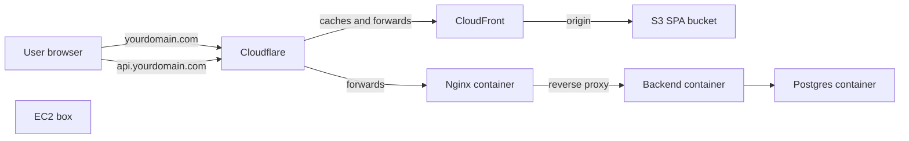

# First-time deployment walkthrough

This plan is the recipe. The reasoning (why this topology, why these AWS services, why Cloudflare in front) lives in [aws_free-tier_deployment_plan_51444d33.plan.md](.cursor/plans/aws_free-tier_deployment_plan_51444d33.plan.md) — read its "What runs where" table in section 3.1 once before starting, then come back here.

**Total time:** 8-12 hours of focused work, spread across 4-5 evenings. Most of the calendar time is waiting for AWS SES sandbox-to-production approval (~24h) and DNS propagation (~1h).

**Total cost:** ~$10/yr for the domain. Everything else is free for the first 12 months on AWS.

---

## The mental model



Three artifacts; three different homes:

- **SPA** = static files sitting in an S3 bucket, fronted by CloudFront. No process running anywhere.
- **Backend** = Docker container running on the EC2 box.
- **Database** = Docker container running on the same EC2 box.

The EC2 box is just a small Linux server in AWS that runs Docker. The wrapper repo's compose file tells Docker which containers to start.

---

## Stage 0 — Accounts and tools (1 evening)

### Accounts to sign up for

| Account | Cost | Time to set up | What you'll do here |
| --- | --- | --- | --- |
| GitHub | Free | (you have it) | Code, container registry (GHCR), CI |
| AWS | $0 first 12 months, credit card required | 20 min | Compute (EC2), storage (S3), CDN (CloudFront), email (SES) |
| Cloudflare | Free | 10 min | DNS, TLS edge, free WAF, domain registrar |
| Domain registrar | ~$10/yr | 10 min | Buy `yourdomain.com`. Recommend Cloudflare Registrar — wholesale price, same account as DNS |

**AWS account hygiene — do these on day one:**

1. Enable MFA on the **root** user (Account → Security credentials → Assign MFA device).
2. Create an IAM user named `deploy` with `PowerUserAccess` policy (IAM → Users → Create user). Generate an access key for it (Security credentials → Create access key → "Command Line Interface").
3. **Never use the root account again** for normal work. Sign in as `deploy` from now on.
4. CloudWatch → Billing → Create alarm → notify if monthly charges exceed $5. Free tier is generous, but if something escapes it you want to know on day 1, not day 30.

### Tools to install on your laptop (macOS)

You already have Node, npm, Docker Desktop, and git from your dev workflow. Add:

```bash
brew install awscli           # talks to AWS from the terminal
brew install gh               # optional, makes CI setup easier
```

Then configure AWS CLI with the `deploy` user's credentials:

```bash
aws configure
# AWS Access Key ID:     <paste>
# AWS Secret Access Key: <paste>
# Default region:        us-east-1     # cheapest off-free-tier, or eu-west-1 if you're in Europe
# Default output:        json
aws sts get-caller-identity   # verify — should print your account number and the deploy user ARN
```

Generate the SSH keypair you'll use to log into the EC2 box:

```bash
ssh-keygen -t ed25519 -f ~/.ssh/healthy-paws-ec2 -C "healthy-paws-prod"
# press enter twice (or set a passphrase if you want)
# this creates ~/.ssh/healthy-paws-ec2 (private, keep secret) and .pub (public)
```

### Repository prep (3 small changes)

Before any deploy, three changes covered in detail in section 3.3 of the architecture plan. In short:

1. Tag the runtime stage in [healthy-paws-service/Dockerfile](healthy-paws-service/Dockerfile) as `AS production`.
2. Add `healthy-paws-wrapper/docker-compose.prod.yml` (template in the architecture plan).
3. Add `healthy-paws-wrapper/.env.prod.example` listing all required env vars with placeholders.

Commit and push all three. The repos must be on GitHub for GHCR to work.

---

## Stage 1 — Domain and DNS (30 min, but DNS propagation can take 1h)

1. **Buy the domain.** Cloudflare → Domains → Register Domains → search → buy. ~$10 for `.com`.
2. **DNS zone is auto-created** since you bought through Cloudflare. If you bought elsewhere (Namecheap, etc.): Cloudflare → Add a Site → free plan, get the two assigned nameservers, paste them at your registrar.
3. **Two DNS records to add right now** (placeholder values — you'll fix them in later stages):
   - `A api ec2-elastic-ip-goes-here` (proxied — orange cloud on)
   - `CNAME @ d111111abcdef8.cloudfront.net` (proxied)
   - `CNAME www d111111abcdef8.cloudfront.net` (proxied)
4. **Cloudflare SSL/TLS mode:** set to **Full (strict)** under SSL/TLS → Overview. You'll generate the origin cert in Stage 8.

---

## Stage 2 — Request SES production access (10 min active, ~24h wait)

Do this EARLY because the wait is on AWS's side. Until it's approved, you can only send email to addresses you've explicitly verified (sandbox mode). That's fine for testing.

1. SES → Identities → Create identity → Domain → `yourdomain.com`. AWS gives you 3 DKIM CNAME records.
2. Add those 3 CNAMEs at Cloudflare DNS (turn the orange cloud OFF for these — DNS-only).
3. Add `TXT @ "v=spf1 include:amazonses.com -all"` and `TXT _dmarc "v=DMARC1; p=quarantine; rua=mailto:dmarc@yourdomain.com"`.
4. SES → Account dashboard → Request production access. Fill the form: use case = "Transactional emails for password reset and email verification in a SaaS app", expected volume = 100/day. Approval usually comes within 24h.

While that's pending, you can keep building. Verify your own personal email as a "verified identity" so password-reset emails work during testing.

---

## Stage 3 — S3 buckets (30 min)

Three buckets, all private (CloudFront and the EC2 instance access them via IAM, never the public).

```bash
# Pick globally unique names. Convention: <project>-<purpose>-<env>
aws s3api create-bucket --bucket healthy-paws-spa-prod    --region us-east-1
aws s3api create-bucket --bucket healthy-paws-avatars-prod --region us-east-1
aws s3api create-bucket --bucket healthy-paws-backups     --region us-east-1

# Block all public access on each (CloudFront uses OAC, not public ACLs)
for b in healthy-paws-spa-prod healthy-paws-avatars-prod healthy-paws-backups; do
  aws s3api put-public-access-block --bucket "$b" \
    --public-access-block-configuration BlockPublicAcls=true,IgnorePublicAcls=true,BlockPublicPolicy=true,RestrictPublicBuckets=true
done
```

Lifecycle policies (do via console for clarity — S3 → bucket → Management → Lifecycle rules):
- `healthy-paws-avatars-prod`: delete objects under `avatars/orphans/` prefix after 7 days.
- `healthy-paws-backups`: transition to Glacier IR after 30 days, expire after 90 days.

---

## Stage 4 — CloudFront for the SPA (45 min, mostly clicking through the console)

The CLI for CloudFront is brutal (30+ flags). Use the AWS Console.

1. CloudFront → Create distribution.
2. **Origin:** S3 bucket → `healthy-paws-spa-prod`. Select **Origin access control settings (recommended)** → Create new OAC → use defaults. AWS will show a bucket policy to copy — click "Copy policy" and paste it at S3 → `healthy-paws-spa-prod` → Permissions → Bucket policy.
3. **Default cache behavior:** Viewer protocol policy = Redirect HTTP to HTTPS. Allowed methods = GET, HEAD.
4. **Settings:**
   - Price class = "Use only North America and Europe" (cheaper).
   - Alternate domain name (CNAME) = `yourdomain.com` and `www.yourdomain.com`.
   - SSL certificate → Request certificate (ACM, **us-east-1**, DNS validation). Adds a CNAME at Cloudflare → click "Create record" buttons in ACM if it doesn't auto-detect.
   - Default root object = `index.html`.
5. **Custom error responses** (after creation, on the distribution): 403 → `/index.html` (HTTP 200), 404 → `/index.html` (HTTP 200). This makes React Router deep links work.
6. Copy the distribution's domain name (looks like `d111111abcdef8.cloudfront.net`) and update those Cloudflare CNAMEs you added in Stage 1.

You can do the same again to set up a second distribution for `cdn.yourdomain.com` pointing at `healthy-paws-avatars-prod` — but that's only needed when you implement avatar uploads. Skip until then.

---

## Stage 5 — First SPA upload (10 min)

Now you have a place to put the SPA. Build it locally and push:

```bash
cd healty-paws-frontend
npm ci
npm run build              # produces dist/

aws s3 sync dist/ s3://healthy-paws-spa-prod/ --delete \
  --cache-control "public,max-age=31536000,immutable" --exclude index.html
aws s3 cp dist/index.html s3://healthy-paws-spa-prod/index.html \
  --cache-control "public,max-age=60"

# Find your distribution ID
aws cloudfront list-distributions --query 'DistributionList.Items[].{Id:Id,Domain:DomainName}'
aws cloudfront create-invalidation --distribution-id <YOUR_ID> --paths "/index.html"
```

Wait 2-3 minutes for CloudFront to propagate, then open `https://yourdomain.com` in a browser. The SPA loads but every API call fails — expected, because there's no backend yet.

---

## Stage 6 — EC2 box (45 min)

Heavily console-driven. EC2 → Launch instances.

| Field | Value |
| --- | --- |
| Name | `healthy-paws-prod` |
| AMI | Amazon Linux 2023 (Free tier eligible) |
| Instance type | t3.micro |
| Key pair | "Create new key pair" — name it `healthy-paws-ec2`, type ed25519. Or **import** the public key you generated (`~/.ssh/healthy-paws-ec2.pub`). |
| Network settings → Edit → Security group | New SG named `healthy-paws-prod-sg`. Inbound rules: SSH from My IP, HTTP from 0.0.0.0/0, HTTPS from 0.0.0.0/0 |
| Storage | 8 GiB gp3 |
| Advanced → IAM instance profile | "Create new IAM role" → service EC2 → attach policies: `AmazonS3FullAccess` (will tighten later), `AmazonSESFullAccess`, `CloudFrontFullAccess` (or build a custom inline policy with just the bucket ARNs and `ses:SendEmail` and the distribution invalidation permission — recommended later) |
| Launch | yes |

After launch: **EC2 → Elastic IPs → Allocate** → Associate with this instance. Note the public IP — call it `<EIP>` for the rest of the plan.

Go back to Cloudflare DNS and set `A api <EIP>` (proxied — orange cloud on).

---

## Stage 7 — Bootstrap the EC2 box (1h)

SSH in:

```bash
ssh -i ~/.ssh/healthy-paws-ec2 ec2-user@<EIP>
```

Inside the box:

```bash
# Install Docker + AWS CLI + git
sudo dnf install -y docker awscli git
sudo systemctl enable --now docker
sudo usermod -aG docker ec2-user
exit         # log out + back in for the group change to apply
ssh -i ~/.ssh/healthy-paws-ec2 ec2-user@<EIP>

# Add 2 GB swap so the backend doesn't OOM-kill Postgres on a memory spike
sudo dd if=/dev/zero of=/swapfile bs=1M count=2048
sudo chmod 600 /swapfile
sudo mkswap /swapfile
sudo swapon /swapfile
echo '/swapfile swap swap defaults 0 0' | sudo tee -a /etc/fstab

# Install docker compose plugin (Amazon Linux 2023 needs this)
DOCKER_CONFIG=${DOCKER_CONFIG:-$HOME/.docker}
mkdir -p $DOCKER_CONFIG/cli-plugins
curl -SL https://github.com/docker/compose/releases/download/v2.29.7/docker-compose-linux-x86_64 \
  -o $DOCKER_CONFIG/cli-plugins/docker-compose
chmod +x $DOCKER_CONFIG/cli-plugins/docker-compose
docker compose version    # verify
```

Harden SSH:

```bash
sudo sed -i 's/^#PasswordAuthentication yes/PasswordAuthentication no/' /etc/ssh/sshd_config
sudo systemctl restart sshd
```

Leave the SSH session open in one terminal — you'll come back here in Stage 9.

---

## Stage 8 — Cloudflare Origin Certificate (15 min)

In a browser, Cloudflare → SSL/TLS → Origin Server → Create Certificate (defaults: RSA 2048, hostnames `yourdomain.com, *.yourdomain.com`, validity 15 years). You'll see two text boxes: certificate and private key. Keep them open.

Back in the SSH session on EC2 (or use `scp` from your laptop):

```bash
mkdir -p ~/healthy-paws-wrapper/nginx/certs
nano ~/healthy-paws-wrapper/nginx/certs/origin.pem   # paste cert, save
nano ~/healthy-paws-wrapper/nginx/certs/origin.key   # paste key, save
chmod 600 ~/healthy-paws-wrapper/nginx/certs/origin.key
```

---

## Stage 9 — First backend image to GHCR (30 min)

On your laptop:

```bash
# Make a GitHub Personal Access Token with "write:packages" scope at
# github.com → Settings → Developer settings → Personal access tokens → Tokens (classic)
# Save the token — call it <GHCR_PAT> in commands below.

echo "<GHCR_PAT>" | docker login ghcr.io -u <your-github-username> --password-stdin

cd healthy-paws-service
docker buildx build --platform linux/amd64 --target production \
  -t ghcr.io/<your-github-username>/healthy-paws-service:latest \
  -t ghcr.io/<your-github-username>/healthy-paws-service:$(git rev-parse --short HEAD) \
  --push .
```

Then go to github.com → your profile → Packages → `healthy-paws-service` → Package settings → Change visibility to Public (or keep Private and grant pull access to the EC2 — public is simpler for first deploy).

---

## Stage 10 — First compose up on EC2 (45 min)

Back in the SSH session:

```bash
cd ~
git clone https://github.com/<you>/healthy-paws-wrapper.git
cd healthy-paws-wrapper

# Populate the prod env file. NEVER commit this file — verify .gitignore covers it.
cp .env.prod.example .env
nano .env

# Required minimum:
#   DB_USER=healthypaws
#   DB_PASSWORD=$(openssl rand -base64 24)    # generate a strong one
#   DB_DATABASE=healthypaws
#   JWT_SECRET=$(openssl rand -hex 32)        # generate, paste
#   FRONTEND_URL=https://yourdomain.com
#   ALLOWED_ORIGINS=https://yourdomain.com
#   MAIL_HOST=email-smtp.us-east-1.amazonaws.com
#   MAIL_PORT=587
#   MAIL_USER=<SES SMTP creds — generate at SES → SMTP settings>
#   MAIL_PASSWORD=<same>
#   APP_NAME=Healthy Paws

# Log into GHCR so docker can pull the backend image
echo "<GHCR_PAT>" | docker login ghcr.io -u <you> --password-stdin

# Pull and start
docker compose -f docker-compose.prod.yml pull
docker compose -f docker-compose.prod.yml up -d
docker compose -f docker-compose.prod.yml ps    # all should be "healthy" or "running"
docker compose -f docker-compose.prod.yml logs -f backend    # watch for errors, ctrl-C to stop
```

If the backend logs show "successfully connected to the database" and "GraphQL ready", you're done with the deploy itself.

---

## Stage 11 — End-to-end smoke test (15 min)

From your laptop:

```bash
curl -i https://api.yourdomain.com/healthz
# expected: HTTP/2 200, body {"status":"ok"}

curl -i https://api.yourdomain.com/api/openapi.json | head
# expected: JSON document
```

In a browser:

1. Open `https://yourdomain.com` — SPA loads.
2. Register an owner account. The form should submit and redirect to "Check your email" (until F-16 email verification is added, it actually just navigates to login).
3. Log in. The dashboard should load and pull data via GraphQL.

If any step fails, the diagnostics are in:
- Backend logs: `docker compose -f docker-compose.prod.yml logs backend --tail 100`
- Nginx logs: `docker compose -f docker-compose.prod.yml logs gateway --tail 100`
- Browser DevTools → Network: look for 401/403/500 responses.

---

## Stage 12 — GitHub Actions for repeatable deploys (2h, do within the first week)

The day-one deploy was manual. After this stage, every `git push origin main` deploys for you.

### Frontend workflow

`.github/workflows/deploy.yml` in [healty-paws-frontend](healty-paws-frontend):

```yaml
name: deploy
on:
  push:
    branches: [main]
permissions:
  id-token: write          # for AWS OIDC
  contents: read
jobs:
  deploy:
    runs-on: ubuntu-latest
    steps:
      - uses: actions/checkout@v4
      - uses: actions/setup-node@v4
        with: { node-version: 20, cache: npm }
      - run: npm ci
      - run: npm test
      - run: npm run build
      - uses: aws-actions/configure-aws-credentials@v4
        with:
          role-to-assume: arn:aws:iam::<account-id>:role/gha-frontend-deploy
          aws-region: us-east-1
      - run: |
          aws s3 sync dist/ s3://healthy-paws-spa-prod/ --delete \
            --cache-control "public,max-age=31536000,immutable" --exclude index.html
          aws s3 cp dist/index.html s3://healthy-paws-spa-prod/index.html \
            --cache-control "public,max-age=60"
          aws cloudfront create-invalidation \
            --distribution-id <YOUR_DIST_ID> --paths "/index.html"
```

The OIDC role `gha-frontend-deploy` is created in IAM with a trust policy that lets `repo:<you>/healty-paws-frontend:ref:refs/heads/main` assume it, and a permissions policy granting `s3:PutObject`/`DeleteObject` on the bucket plus `cloudfront:CreateInvalidation` on the distribution. Walkthrough: [docs.aws.amazon.com/IAM/latest/UserGuide/id_roles_create_for-idp_oidc.html](https://docs.aws.amazon.com/IAM/latest/UserGuide/id_roles_create_for-idp_oidc.html).

### Backend workflow

`.github/workflows/deploy.yml` in [healthy-paws-service](healthy-paws-service):

```yaml
name: deploy
on:
  push:
    branches: [main]
permissions:
  contents: read
  packages: write          # for GHCR
jobs:
  build-push:
    runs-on: ubuntu-latest
    steps:
      - uses: actions/checkout@v4
      - uses: actions/setup-node@v4
        with: { node-version: 20, cache: npm }
      - run: npm ci
      - run: npm test
      - uses: docker/login-action@v3
        with:
          registry: ghcr.io
          username: ${{ github.actor }}
          password: ${{ secrets.GITHUB_TOKEN }}
      - uses: docker/setup-buildx-action@v3
      - uses: docker/build-push-action@v6
        with:
          context: .
          target: production
          platforms: linux/amd64
          push: true
          tags: |
            ghcr.io/${{ github.repository_owner }}/healthy-paws-service:latest
            ghcr.io/${{ github.repository_owner }}/healthy-paws-service:${{ github.sha }}
  rollout:
    needs: build-push
    runs-on: ubuntu-latest
    steps:
      - name: Deploy via SSM
        uses: peterkimzz/aws-ssm-send-command@master
        with:
          aws-region: us-east-1
          instance-ids: i-xxxxxxxxxxxx
          working-directory: /home/ec2-user/healthy-paws-wrapper
          command: |
            docker compose -f docker-compose.prod.yml pull backend
            docker compose -f docker-compose.prod.yml up -d backend
```

The SSM-based rollout avoids SSHing from CI (cleaner than storing SSH keys in GitHub secrets). The EC2 instance needs `AmazonSSMManagedInstanceCore` attached to its instance profile and the SSM Agent installed (Amazon Linux 2023 already has it).

---

## Stage 13 — Backups (15 min)

Still in the EC2 SSH session:

```bash
crontab -e
# add this line:
0 3 * * * cd /home/ec2-user/healthy-paws-wrapper && docker compose -f docker-compose.prod.yml exec -T db pg_dump -U $(grep DB_USER .env|cut -d= -f2) $(grep DB_DATABASE .env|cut -d= -f2) | gzip | aws s3 cp - s3://healthy-paws-backups/$(date +\%F).sql.gz
```

The lifecycle policy on the backups bucket (set in Stage 3) handles retention.

**Test the restore right now**, while the box is healthy:

```bash
aws s3 cp s3://healthy-paws-backups/$(date +%F).sql.gz - 2>/dev/null | gunzip | head -50
# should be readable SQL
```

A backup you've never restored is not a backup.

---

## Stage 14 — Lock things down (30 min, do within the first week)

1. **Tighten the EC2 IAM instance profile** — swap the broad `AmazonS3FullAccess` etc. for a custom inline policy that only allows the specific actions on the specific bucket/distribution ARNs.
2. **Tighten the `deploy` IAM user** — once the GitHub Actions OIDC roles work, remove the access key from the `deploy` user (or change `PowerUserAccess` to `ReadOnlyAccess` + specific write grants).
3. **Cloudflare WAF rules** (free tier): block known bad bots, rate-limit `POST /api/auth/login` at the edge as a second layer behind your in-app limiter.
4. **Sentry** for both frontend and backend (free dev plan).
5. **Email verification (F-16)** and **audit log (F-26)** — both outlined in the [security roadmap plan](.cursor/plans/security_and_ops_roadmap_65e3f986.plan.md).

---

## Total time and cost

| Stage | Active time | Wait time |
| --- | --- | --- |
| 0 — Accounts and tools | 1.5h | — |
| 1 — Domain + DNS | 30 min | 1h propagation |
| 2 — SES request | 10 min | 24h approval |
| 3 — S3 buckets | 30 min | — |
| 4 — CloudFront for SPA | 45 min | 15 min distribution provisioning |
| 5 — First SPA upload | 10 min | 5 min invalidation |
| 6 — EC2 launch | 45 min | — |
| 7 — Bootstrap EC2 | 1h | — |
| 8 — Cloudflare Origin Cert | 15 min | — |
| 9 — First backend image | 30 min | — |
| 10 — First compose up | 45 min | — |
| 11 — Smoke test | 15 min | — |
| 12 — GitHub Actions | 2h | — |
| 13 — Backups | 15 min | — |
| 14 — Lockdown follow-ups | 30 min | — |
| **Total** | **~10 hours** | **~25 hours of waiting** |

Active hours fit cleanly into 4-5 evenings. Calendar time end-to-end is ~5 days because of SES approval.

| Cost item | Year 1 | After |
| --- | --- | --- |
| Domain | $10 | $10/yr |
| EC2 + S3 + CloudFront + SES | $0 (free tier) | ~$5-10/mo |
| **Total** | **$10** | **~$70-130/yr** |

---

## Glossary (things that confused me when I started)

- **IAM user vs IAM role.** A *user* is an identity that a human (or a script on your laptop) authenticates as with a username/key. A *role* is an identity that an AWS service (like EC2) assumes automatically. The EC2 box uses a *role* so you never have to put long-lived AWS keys on it.
- **SSH keypair.** Two files. The public key goes on the server (`~/.ssh/authorized_keys`). The private key stays on your laptop. SSH lets you in only if the keys match. Treat the private key like a password.
- **DNS A record vs CNAME.** `A` points a hostname at an IP address (use for `api.yourdomain.com` → EC2's Elastic IP). `CNAME` points a hostname at another hostname (use for `cdn.yourdomain.com` → CloudFront's `d111111abcdef8.cloudfront.net`).
- **Container registry (GHCR).** A place to store Docker images. GitHub gives you one for free, scoped to your account.
- **Cache invalidation.** Telling a CDN to drop its cached copy of a file so the next request fetches the new version. CloudFront charges nothing for the first 1000 invalidation paths per month.
- **OIDC (in the GitHub Actions context).** A way for GitHub Actions to assume an AWS IAM role without you storing AWS access keys as GitHub secrets. The trust relationship is cryptographically verified by AWS on each workflow run.
- **Elastic IP.** A static public IPv4 address you can attach to an EC2 instance so the address survives reboots and instance replacements. Free while attached to a running instance, ~$3.60/mo if unattached.
- **Cloudflare proxy mode ("orange cloud on").** Traffic for that record passes through Cloudflare's edge before reaching your origin. Enables free TLS, WAF, and caching. "Orange cloud off" = DNS-only (use for SES DKIM records, which Cloudflare shouldn't touch).