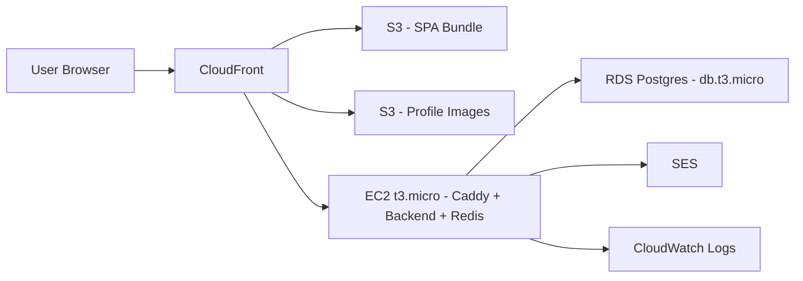

# Healthy Paws: security, best-practice, and ops roadmap

This plan reviews [healthy-paws-service](healthy-paws-service), [healty-paws-frontend](healty-paws-frontend), and [healthy-paws-wrapper](healthy-paws-wrapper) (incl. its [docker-compose.yml](healthy-paws-wrapper/docker-compose.yml) and [nginx/nginx.conf](healthy-paws-wrapper/nginx/nginx.conf)), then lays out the next-phase work: S3 uploads, caching, AWS free-tier deployment, and DevOps tooling. F-16 (email verification) and F-26 (audit log) are captured here as implementation outlines so they slot into the same roadmap.

Severity legend: `[H]` high, `[M]` medium, `[L]` low.

---

## 1. Critical security findings still open (fix before deploy)

These are concrete issues found in the current source; all have file/line citations.

- `[H]` ~~**GraphQL `owners` query returns every owner to any authenticated user.**~~ **FIXED.** Query was unused by the frontend (only `owner(id)` is consumed). Deleted end-to-end: removed `owners: [Owner!]` from [src/schema/typeDefs.graphql](healthy-paws-service/src/schema/typeDefs.graphql), the resolver in [src/features/owners/owners.resolvers.ts](healthy-paws-service/src/features/owners/owners.resolvers.ts), the service method in [src/features/owners/owners.service.ts](healthy-paws-service/src/features/owners/owners.service.ts), and `getAllOwners()` in [src/features/owners/owners.repository.ts](healthy-paws-service/src/features/owners/owners.repository.ts). Build + 40 tests pass. Frontend codegen (`npm run generate` in [healty-paws-frontend](healty-paws-frontend)) should be re-run against the updated schema next time the dev stack is up to drop `owners` from generated types.

- `[H]` **Public GraphQL queries on doctors.** `wrapResolvers` is only applied to a subset of resolvers in [src/schema/resolvers.ts:27-33](healthy-paws-service/src/schema/resolvers.ts); doctor list/detail queries currently return without `requireAuth`. Decide explicitly: public marketing directory (then strip PII like email/phone) vs. authenticated-only.

- `[H]` **No rate limit on registration endpoints.** `/api/auth/register/owner` and `/api/auth/register/doctor` in [src/features/registration/registration.routes.ts:13-15](healthy-paws-service/src/features/registration/registration.routes.ts) have no `express-rate-limit`. Reuse the pattern in [src/core/middleware/rate-limit.ts](healthy-paws-service/src/core/middleware/rate-limit.ts).

- `[H]` **GraphQL has no depth/complexity limits and no per-resolver rate limiting.** Add `graphql-depth-limit` and `graphql-validation-complexity` (or `@escape.tech/graphql-armor`) to the Apollo Server config in [src/app.ts:71-77](healthy-paws-service/src/app.ts). Also explicitly set `introspection: process.env.NODE_ENV !== "production"`.

- `[H]` **Postgres port 5432 published to host.** [healthy-paws-wrapper/docker-compose.yml:11-12](healthy-paws-wrapper/docker-compose.yml). Remove the `ports:` block; backend reaches it via the compose network. Keep only when explicitly debugging.

- `[H]` **No TLS at the gateway.** [healthy-paws-wrapper/nginx/nginx.conf](healthy-paws-wrapper/nginx/nginx.conf) listens on 80 only. For any non-local deployment, terminate TLS. Easiest path on EC2 free tier: replace nginx with **Caddy** (auto-Let's Encrypt) or add a Certbot sidecar.

- `[H]` **Containers run as root.** Backend `Dockerfile` and the `nginx:alpine` gateway both lack a non-root `USER`. Add a dedicated user, e.g. `USER node` in the backend final stage and `nginxinc/nginx-unprivileged` (or chown `/var/cache/nginx`, `/var/run`, `/etc/nginx/conf.d`) for the gateway.

- `[H]` **Silent JWT errors on the GraphQL path.** [src/app.ts:102-108](healthy-paws-service/src/app.ts) calls `next()` even when `passport.authenticate` returns `err`. Forward real errors (`next(err)`) and only fall through to anonymous on the no-token case so misconfiguration is visible.

- `[H]` ~~**Frontend Apollo cache is not cleared on logout.**~~ **FIXED.** `apolloClient.clearStore()` is now called in three places: [src/context/AuthenticationContext.tsx](healty-paws-frontend/src/context/AuthenticationContext.tsx) on `logout()` and on the `/session` 401 eviction path, and in [src/lib/graphql/apollo-wrapper.tsx](healty-paws-frontend/src/lib/graphql/apollo-wrapper.tsx) inside `handleUnauthenticated` for GraphQL `UNAUTHENTICATED` / REST 401 errors. 250/250 frontend tests pass, build green.

- `[H]` **Nginx is missing security headers.** Add to [nginx/nginx.conf](healthy-paws-wrapper/nginx/nginx.conf):
  - `add_header Strict-Transport-Security "max-age=63072000; includeSubDomains" always;`
  - `add_header X-Content-Type-Options "nosniff" always;`
  - `add_header X-Frame-Options "DENY" always;` (or use CSP `frame-ancestors`)
  - `add_header Referrer-Policy "strict-origin-when-cross-origin" always;`
  - `add_header Content-Security-Policy "default-src 'self'; img-src 'self' data: https://<your-cdn>; style-src 'self' 'unsafe-inline' https://fonts.googleapis.com; font-src 'self' https://fonts.gstatic.com; connect-src 'self'; frame-ancestors 'none';" always;`
  - `client_max_body_size 1m;` (explicit; switch to presigned S3 uploads instead of raising it).

- `[M]` **JWT revocation impossible.** Password reset does not invalidate prior tokens; logout only clears the cookie on that browser. Two clean options:
  - Add a `token_version` integer to the `Users` row; include in JWT claims; resolvers check current value (cheap, no new infra).
  - Or introduce a Redis denylist keyed by `jti` with TTL = remaining JWT lifetime (sets up nicely for the Redis phase below).

- `[M]` **Cookie lifetime drift.** Cookie is hard-coded `maxAge: 60*60*1000` in [src/features/authentication/authentication.controller.ts:51](healthy-paws-service/src/features/authentication/authentication.controller.ts) but JWT lifetime is `JWT_EXPIRES_IN`. Derive the cookie `maxAge` from the JWT TTL.

- `[M]` **`logout` does not pass cookie options to `clearCookie`.** Same file — pass `{ httpOnly: true, secure: ..., sameSite: "strict", path: "/" }` for reliable clearing across browsers.

- `[M]` **No DB SSL or pool sizing.** [src/core/config/db.ts:6-12](healthy-paws-service/src/core/config/db.ts). Add `ssl: { rejectUnauthorized: false }` (or full CA) when `DATABASE_SSL=true`, plus `max`, `idleTimeoutMillis`, `connectionTimeoutMillis`. Required for RDS.

- `[M]` **No migration runner.** Only [healthy-paws-service/database.sql](healthy-paws-service/database.sql) exists. Pick one: `node-pg-migrate` (lightweight, matches current `pg` stack) or `Prisma migrate` (heavier but gives a typed client). Strong recommendation: `node-pg-migrate` — minimal change, supports up/down and CI gating.

- `[M]` **CI is missing SAST and container scanning.** Both repo workflows ([healthy-paws-service/.github/workflows/pipeline.yml](healthy-paws-service/.github/workflows/pipeline.yml), [healty-paws-frontend/.github/workflows/pipeline.yml](healty-paws-frontend/.github/workflows/pipeline.yml)) only run `npm audit`. Add CodeQL, `actions/dependency-review-action`, and Trivy image scan.

- `[M]` **Compose hardening:** no `restart:` policy, no resource limits, no log rotation, no healthchecks on backend/frontend/gateway. Add `restart: unless-stopped`, `deploy.resources.limits` (mem 256m backend, 128m gateway), `logging.driver: json-file` with `max-size` and `max-file`, and a `/healthz` route on backend wired to a Compose healthcheck.

- `[M]` **`${DB_USER}`/`${DB_PASSWORD}` interpolation in compose has no `.env` at the wrapper root.** [docker-compose.yml:8-11](healthy-paws-wrapper/docker-compose.yml) interpolates from the shell or a root `.env`, not from `env_file:`. Add `healthy-paws-wrapper/.env.example` documenting the required variables and load with `docker compose --env-file ./.env`.

- `[L]` **Node version mismatch.** Dockerfile uses `node:20-alpine`, CI uses Node 22, `package.json` has no `engines`. Pin `"engines": { "node": ">=20.11 <23" }` and align CI.

- `[L]` **Dead dependency.** `express-session` is listed but never used in `src/`. Remove.

- `[L]` **Frontend password validation inconsistency.** [src/pages/auth/register/RegisterDoctorPage.tsx:113-118](healty-paws-frontend/src/pages/auth/register/RegisterDoctorPage.tsx) says "at least 6 characters" but other flows enforce 8 + complexity via [src/pages/auth/register/components/passwordValidation.ts](healty-paws-frontend/src/pages/auth/register/components/passwordValidation.ts). Unify with the reset-password validator.

- `[L]` **`AvatarImage` stores base64 images in `localStorage`.** [src/components/ui/AvatarImage](healty-paws-frontend/src/components/ui). This will be displaced by the S3 work below — track here so it gets removed.

- `[L]` **`.gitignore` doesn't list bare `.env`** in the frontend repo (only `*.local`). Add `.env` explicitly. The wrapper does this correctly.

- `[L]` **No `.env.example` files** anywhere. Add three — wrapper, backend, frontend — listing required variables with safe placeholder values.

---

## 2. MERN+GraphQL best-practice gaps

- ~~**Route-level guards on the frontend.**~~ **FIXED.** [src/App.tsx](healty-paws-frontend/src/App.tsx) now groups routes under three parent `<Route element={<ProtectedRoute roles=...>}>` layouts (owner-only, doctor-only, any-authenticated) plus a `<Route element={<PublicRoute />}>` layout for the auth pages. [ProtectedRoute](healty-paws-frontend/src/router/ProtectedRoute/ProtectedRoute.tsx) and [PublicRoute](healty-paws-frontend/src/router/PublicRoute/PublicRoute.tsx) now render `<Outlet/>` when used as layouts and still accept `children` for in-page defense-in-depth. New layout-mode tests added.

- ~~**Adopt `react-hook-form` + `zod` on the frontend.**~~ **FIXED.** [LoginPage](healty-paws-frontend/src/pages/auth/login/LoginPage.tsx), [RegisterOwnerPage](healty-paws-frontend/src/pages/auth/register/RegisterOwnerPage.tsx), [RegisterDoctorPage](healty-paws-frontend/src/pages/auth/register/RegisterDoctorPage.tsx), [RequestResetLinkForm](healty-paws-frontend/src/pages/auth/register/components/RequestResetLinkForm.tsx), and [NewPasswordForm](healty-paws-frontend/src/pages/auth/register/components/NewPasswordForm.tsx) all use `react-hook-form` + `zodResolver`. Shared client schemas mirror the backend in [src/lib/validation/auth.ts](healty-paws-frontend/src/lib/validation/auth.ts) and [src/lib/validation/registration.ts](healty-paws-frontend/src/lib/validation/registration.ts). [Select](healty-paws-frontend/src/components/ui/Select/Select.tsx) was upgraded to `forwardRef` for RHF compatibility. Hand-rolled `passwordValidation.ts` deleted.

- ~~**Apollo Client uplift.**~~ **FIXED.** [apollo-wrapper.tsx](healty-paws-frontend/src/lib/graphql/apollo-wrapper.tsx) link chain is now `errorLink → retryLink → persistedQueriesLink → httpLink`. `RetryLink` retries idempotent operations only (mutations are explicitly excluded so they never duplicate). `createPersistedQueryLink` (APQ) hashes queries with the browser's `crypto.subtle` SHA-256.

- ~~**GraphQL hardening pack.**~~ **FIXED** (already part of the critical security batch via [`@escape.tech/graphql-armor`](https://github.com/Escape-Technologies/graphql-armor) in [src/app.ts](healthy-paws-service/src/app.ts)).

- **Structured logging.** Replace `console.*` with `pino` (small, fast, JSON) + `pino-http`. This is also the substrate for the audit log (F-26). _(Intentionally skipped in this batch — bundled with the F-26 audit log work below so logging and audit ship together.)_

- ~~**OpenAPI/REST schema for the few REST endpoints.**~~ **FIXED.** [src/openapi/registry.ts](healthy-paws-service/src/openapi/registry.ts) generates an OpenAPI 3.0 document from the existing Zod schemas using `@asteasolutions/zod-to-openapi`. Served at `GET /api/openapi.json`. Generated once at startup and cached.

- ~~**Bundle hygiene.**~~ **FIXED.** Frontend: [vite.config.ts](healty-paws-frontend/vite.config.ts) sets `build.sourcemap: "hidden"` and conditionally enables `rollup-plugin-visualizer` when `ANALYZE=1`; new `npm run analyze` script. Backend: [Dockerfile](healthy-paws-service/Dockerfile) runtime stage now runs `npm ci --omit=dev` so vitest, codegen, etc. don't ship in the image.

- ~~**Testing gaps with concrete value.**~~ **FIXED.** New integration tests under [src/test/integration/](healthy-paws-service/src/test/integration): `cors.test.ts` (allowlist + preflight denial), `rate-limit.test.ts` (429 after budget), `graphql-armor.test.ts` (depth, token, alias rejection), `cross-role-authz.test.ts` (unauthenticated query/mutation rejection at the schema level + FORBIDDEN propagation), `reset-enumeration.test.ts` (identical response shape for known/unknown emails). 58 tests pass.

- ~~**Coverage gates.**~~ **FIXED.** [healthy-paws-service/vitest.config.ts](healthy-paws-service/vitest.config.ts) enforces 60% project floor with 75%+ in `src/features/authentication/**` and 90%+ in `authorization.utils.ts`. [healty-paws-frontend/vite.config.ts](healty-paws-frontend/vite.config.ts) enforces 60% project floor with 80%+ in `AuthenticationContext.tsx` and `src/router/**`.

---

## 3. F-16: email verification before login (implementation outline)

Goal: a user cannot complete `/api/auth/login` until they have clicked a verification link sent at registration.

- **Schema:** add to `Users` (in [database.sql](healthy-paws-service/database.sql) plus a `node-pg-migrate` migration):
  - `email_verified BOOLEAN NOT NULL DEFAULT FALSE`
  - `email_verified_at TIMESTAMPTZ`
- New table `EmailVerificationTokens(user_id, token_hash, expires_at, used_at)`, mirroring the existing `PasswordResetTokens` pattern.
- **Registration flow** ([src/features/registration/registration.service.ts](healthy-paws-service/src/features/registration/registration.service.ts)): after the transactional insert, generate a random token (`crypto.randomBytes(32).toString("base64url")`), store SHA-256 hash + 24h expiry, send an email reusing the [src/email-template.ts](healthy-paws-service/src/email-template.ts) builder pattern. Mailer config is already in `authentication.service.ts:117-133`.
- **Login flow** ([src/features/authentication/authentication.service.ts:43-64](healthy-paws-service/src/features/authentication/authentication.service.ts)): after `bcrypt.compare`, reject with a domain error like `EmailNotVerifiedError` mapped to HTTP 403 by [src/core/middleware/error-middleware.ts](healthy-paws-service/src/core/middleware/error-middleware.ts), with a message that does not differ in timing/shape from invalid-credentials (to avoid enumeration).
- **New endpoints:**
  - `POST /api/auth/verify-email` (body: `{ token }`) — marks verified, deletes token; rate-limited.
  - `POST /api/auth/resend-verification` (body: `{ email }`) — same-shape response regardless of email existence; rate-limited (1/min/IP, 5/day/email).
- **Frontend:** new `/auth/verify-email` route that reads `?token=...`, posts to the endpoint, shows success/error. Login page surfaces "resend verification" CTA on the 403 case.
- **Tests:** unverified login is rejected; verification flips the flag; tokens single-use; expiry honored; rate limits enforced; same-shape responses.

---

## 4. F-26: audit log (implementation outline)

Goal: a tamper-evident, queryable record of security-relevant events.

- **Storage:** Postgres table `AuditEvents(id, occurred_at, actor_user_id NULL, actor_role NULL, ip, user_agent, action, target_type, target_id NULL, outcome, metadata JSONB)`. Index on `(actor_user_id, occurred_at DESC)` and `(action, occurred_at DESC)`.
- **Events to capture:**
  - Auth: `login.success`, `login.failure`, `logout`, `password.reset.requested`, `password.reset.completed`, `email.verify.requested`, `email.verify.completed`.
  - Authz: `authz.deny` (resolver-level denials).
  - Mutations: appointment create/update/remove, doctor profile edits, owner profile edits, pet create/update.
- **Implementation:**
  - `src/features/audit/audit.service.ts` with `record(event)` (best-effort: never throws into the request path).
  - Express middleware that captures `ip` (trust proxy from nginx) and `user_agent`, and an Apollo plugin `auditMutations` analogous to [src/schema/plugins/requireAuthMutations.ts](healthy-paws-service/src/schema/plugins/requireAuthMutations.ts) that logs mutation outcomes.
  - All entries also emitted via `pino` for shipping to CloudWatch/Sentry/Datadog later.
- **Privacy:** never log password hashes, never log full request bodies, hash IPs if you later need GDPR-friendly retention.
- **Retention:** add a daily job to delete events older than 365 days.
- **Tests:** writes during login success/failure, denies, mutations; verify no PII in `metadata`.

---

## 5. Future: S3 for profile images (recommended design)

- **Bucket:** one S3 bucket per environment, e.g. `healthy-paws-profile-images-prod`. Private (no public ACL). Bucket policy denies all except CloudFront OAC.
- **CDN:** CloudFront distribution in front of the bucket with Origin Access Control. ACM cert on CloudFront. Cache policy: `max-age=31536000, immutable` and content-addressed keys (`profiles/{userId}/{sha256}.webp`) so updates don't need invalidations.
- **Upload pattern — presigned PUT (recommended):**
  - New backend mutation `requestProfileImageUpload(contentType: String!): { uploadUrl, key, expiresAt }` that validates the content type (`image/jpeg|png|webp`), enforces max size (e.g. 2 MB) via the presigned policy, and returns a single-use presigned URL valid for 60s.
  - Frontend uploads the file directly to S3 via `fetch(uploadUrl, { method: "PUT", body: file })`. Backend never sees image bytes (saves bandwidth, avoids `client_max_body_size` pain at nginx).
  - On success the frontend calls `confirmProfileImage(key)` which updates `Users.image_url` (already in the schema, see [database.sql:9](healthy-paws-service/database.sql)).
- **Server-side image processing (optional, later):** S3 event trigger -> Lambda -> sharp to generate webp + sizes; write to `profiles/{userId}/{sha256}/{size}.webp`.
- **Security:**
  - Validate IAM: backend role only has `s3:PutObject` (via signing) on `arn:aws:s3:::bucket/profiles/${userId}/*`.
  - Strip EXIF in the Lambda step.
  - Bucket has `BlockPublicAcls`, `IgnorePublicAcls`, `BlockPublicPolicy`, `RestrictPublicBuckets` all on.
- **Frontend cleanup:** remove the `localStorage` base64 avatar logic in [AvatarImage](healty-paws-frontend/src/components/ui/AvatarImage) and read from `user.image_url` (CloudFront URL).

---

## 6. Future: caching — where CDN helps vs where Redis helps

Different layers with different jobs:

- **CDN (CloudFront): use for**
  - SPA static assets (JS/CSS/fonts/images) — biggest win, frees EC2 from serving bytes.
  - S3-hosted profile images.
  - Optional: cache public, anonymous GraphQL `Query` responses (e.g. doctor directory) by sending `Cache-Control: public, max-age=...` from the resolver and using a separate cache policy that includes `POST /graphql` with the query body in the cache key. Skip if the doctor directory becomes auth-only.
  - Not useful for: authenticated, per-user data (set `Cache-Control: private, no-store` for those).

- **Redis (ElastiCache or self-hosted on EC2): use for**
  - **JWT denylist** for revocation on logout / password change (key by `jti`, TTL = remaining lifetime).
  - **Distributed rate limiting** when you scale past one backend instance — swap `express-rate-limit` for `rate-limit-redis` so counts are shared.
  - **Hot read cache** for expensive aggregations: doctor specializations, availability slots for the next 7 days, search results. Keep TTLs short (60-300s) and invalidate on mutation.
  - **Email verification / password reset throttling** keyed by email or IP (counter + TTL), more robust than per-process in-memory counters.
  - **Session store** if you ever move off JWT to opaque sessions (also good for revocation).
  - Not useful for: per-request DataLoaders ([src/features/*/.loaders.ts](healthy-paws-service/src/features) are already per-request and in-process).

- **App-layer cache plugin:** add Apollo's `@apollo/server-plugin-response-cache` once Redis exists, with `KeyValueCache` backed by `keyv` + `@keyv/redis`. Honor `cacheControl` hints in the schema.

- **Database query cache:** if you stay on RDS free tier, this is unnecessary at current scale. Revisit when you have measurable hot queries.

---

## 7. Future: AWS free-tier deployment topology

Free tier (12 months) gives you 750 hours of one t2.micro/t3.micro EC2, 750 hours of one db.t3.micro RDS, 5 GB S3, 1 TB CloudFront egress, SES (62k emails when sending from EC2). Always-free includes Lambda 1M req/mo, CloudWatch basic. ElastiCache is **not** in the free tier.

Recommended topology:

- **Frontend:** `vite build` artifacts to S3, fronted by CloudFront with ACM cert. Cache policy: long max-age on hashed assets, short on `index.html`. CI uploads + creates an invalidation on `/index.html` only.
- **Backend:** Docker container on a single EC2 t3.micro behind **Caddy** (auto-TLS via Let's Encrypt; one-line config). Replace nginx for the public deployment — keeps free-tier simple. Same EC2 runs a tiny Redis process (~50 MB RAM, `maxmemory 128mb`, eviction `allkeys-lru`).
- **Database:** RDS Postgres db.t3.micro in a private subnet, SSL on, automated backups (free tier includes 20 GB of backups). Connect from the EC2 security group only.
- **DNS + TLS:** Route 53 hosted zone (~$0.50/month, not free) or use Cloudflare (free) as DNS in front of CloudFront/EC2; ACM certs are free.
- **Email:** SES (move out of SES sandbox before launch; until then it only sends to verified addresses, which is fine for testing email verification).
- **Secrets:** AWS SSM Parameter Store (free for standard parameters). EC2 reads at boot via IAM instance profile — never bake into the image.
- **Logs/metrics:** CloudWatch agent on EC2 ships `pino` JSON logs; basic CloudWatch metrics free. Add Sentry free tier (5k events/mo) for frontend + backend error monitoring.

Cost notes:

- Stay inside free tier as long as you have one backend instance and one DB.
- If Redis pressure becomes real, move to a smaller t4g.nano EC2 dedicated to Redis (~$3/mo) before paying for ElastiCache.
- ALB is **not** in the free tier (~$16/mo idle); use Caddy on the EC2 instead until you genuinely need multi-AZ.

---

## 8. DevOps / automation toolkit

Phase these in — don't adopt all at once.

- **Now (low effort, high payoff):**
  - **Pre-commit:** Husky + lint-staged + `eslint --fix` + `prettier`. Add `commitlint` if you want Conventional Commits.
  - **CI improvements (both repos):** add `actions/dependency-review-action`, GitHub CodeQL, and `aquasecurity/trivy-action` to scan built images. Cache `npm` with `actions/setup-node@v4`'s built-in caching. Gate merges on green.
  - **`.env.example`** at every level + a tiny `scripts/check-env.ts` that runs on `start` and fails fast on missing required vars (saves silent prod misconfig).
  - **Renovate** (more configurable than Dependabot; supports lockfile maintenance, grouped updates, auto-merge for patch).

- **Soon (deployment phase):**
  - **Infrastructure as Code: Terraform** (modules per concern: vpc, rds, s3-cdn, ec2). Alternative: **AWS CDK** in TypeScript — closer to your stack but bigger learning curve. Pick Terraform if you want portability, CDK if you want to stay in TS-only.
  - **GitHub Actions deploy job** using OIDC -> AWS IAM role (no long-lived secrets). Stages: build image, push to GHCR or ECR (ECR private repo is free up to 500 MB), SSH/SSM to EC2 to `docker compose pull && up -d`, or use Watchtower on the EC2.
  - **Container registry: GitHub Container Registry** (free for public; private has generous free quotas). Alternative: ECR.
  - **Database migrations:** `node-pg-migrate` invoked from a one-off migration job in CI before the backend update.

- **As you grow:**
  - **Observability:** Sentry (errors), CloudWatch or Grafana Cloud free tier (logs/metrics), `@opentelemetry/*` instrumentation on the backend.
  - **Performance budgets:** Lighthouse CI on the frontend repo against a preview deploy.
  - **Load testing:** k6 scripts checked in alongside the backend; run on releases.
  - **Feature flags:** `@openfeature/server-sdk` with a simple provider (env-var or LaunchDarkly free tier).
  - **Backup verification:** monthly automated restore of an RDS snapshot into a scratch instance and `pg_dump` diff against schema.
  - **Vulnerability scanning at runtime:** Falco or AWS Inspector if you outgrow the free tier.

---

## 9. Suggested order of execution

This sequencing fixes the most dangerous things first, then unblocks the deployment work without rewriting it later.

1. **Critical security batch** (~1-2 days): rate limit registration, gate `owners` query and doctor queries, add `graphql-armor`, fix silent JWT errors, harden cookies, add nginx security headers, run Docker as non-root, unpublish Postgres port, add `.env.example` files. Cite each fix in the PR with the file:line above.
2. **DB hygiene** (~1 day): introduce `node-pg-migrate`, port the existing `database.sql` to migrations, add DB SSL config, pool sizing, healthcheck endpoint `/healthz` on backend.
3. **F-16 email verification** (~1-2 days): tables + migration, verification endpoints, login gate, frontend route, rate limits, tests. Same-shape responses for enumeration safety.
4. **F-26 audit log** (~1 day): table + migration, `audit.service`, Apollo `auditMutations` plugin, REST middleware, swap `console.*` for `pino` everywhere.
5. **Frontend polish** (~1 day): centralize route guards in `App.tsx`, `client.clearStore()` on logout/401, unify password validation, remove `express-session` dep, add coverage thresholds.
6. **CI hardening** (~half day): CodeQL, Trivy, dependency-review, Renovate.
7. **AWS deployment (free tier)** (~3-5 days): Terraform modules, S3+CloudFront for SPA, RDS migration, EC2 with Caddy + Docker Compose, SES, SSM Parameter Store, GitHub Actions OIDC deploy job.
8. **S3 profile images** (~1-2 days): bucket + CloudFront + presigned PUT mutation + frontend uploader + cleanup of `localStorage` avatars.
9. **Redis** (~1 day): co-locate on EC2, wire JWT denylist, `rate-limit-redis`, optional Apollo response cache for public reads.
10. **Observability + perf** (~1-2 days): Sentry, CloudWatch agent, Lighthouse CI, k6 baseline.

Total: ~14-20 focused working days for a solo developer to go from current state to a hardened, deployed, observable, modern MERN+GraphQL app on AWS free tier.
