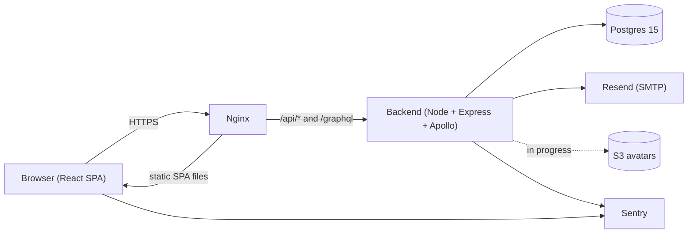
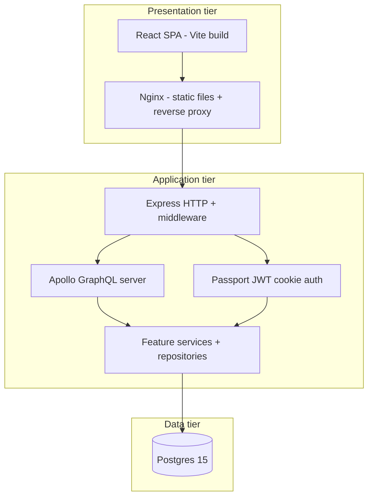
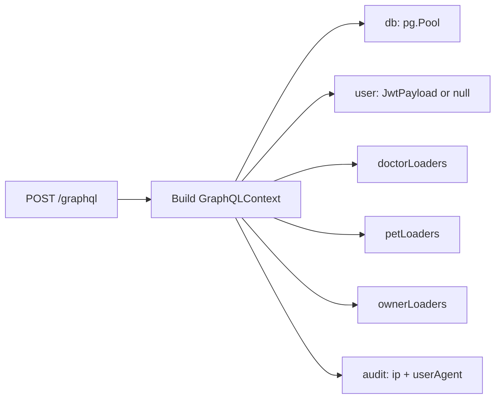
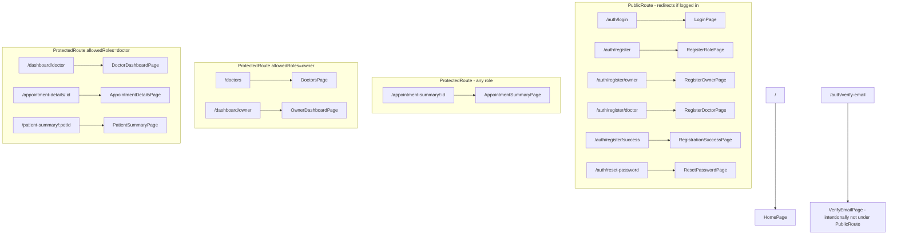
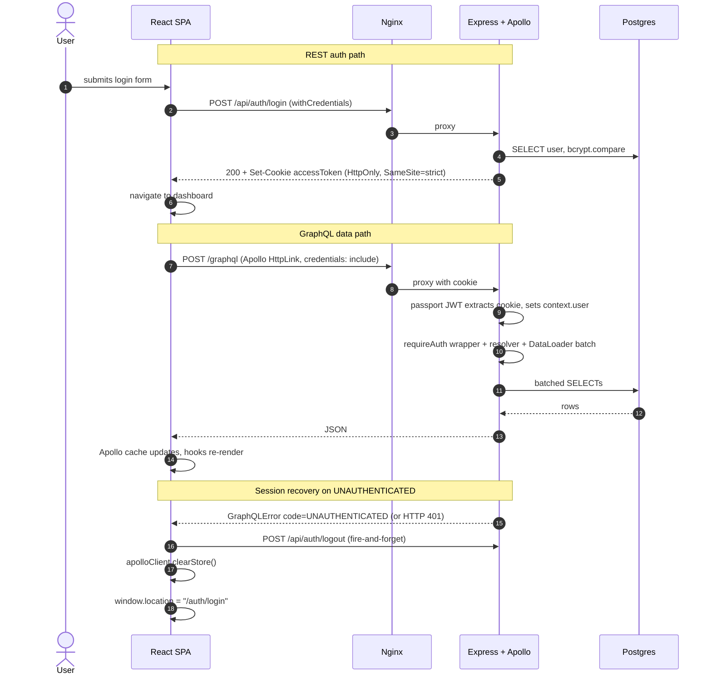
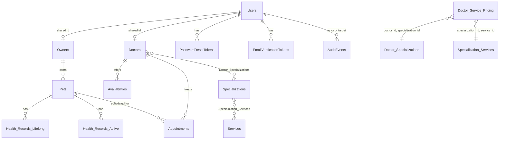
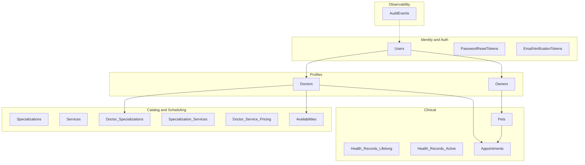
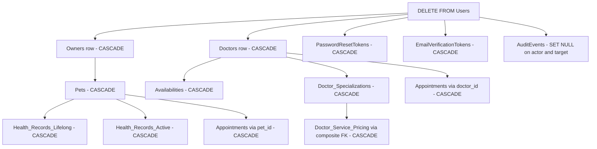

# Healthy Paws — Technical Architecture

This document covers the technical side of Healthy Paws — the tech stack, the request lifecycle, how the frontend and backend talk to each other, the database design, and the deployment topology. The companion [`BUSINESS-LOGIC.md`](BUSINESS-LOGIC.md) covers the domain rules and user-facing flows; this document covers how those rules are implemented.

Items the application does not run yet, but that the deployment plan will deliver, are marked `**In progress** —`.

---

## 1. One-page system overview



Each box at a glance:

- **Browser** runs the React SPA built by Vite. It talks to the backend over the same origin: REST (axios) for auth, GraphQL (Apollo Client) for everything else, both sending the `accessToken` cookie automatically.
- **Nginx** terminates the connection. Locally it routes `/` to the Vite dev server container and `/api/*` + `/graphql` to the backend container. In production it serves the prebuilt SPA from disk and reverse-proxies the API.
- **Backend** is a single Node process that exposes an Express app with both REST routes (under `/api/auth/*`) and a mounted Apollo GraphQL server at `/graphql`.
- **Postgres** is the only persistent datastore. Schema is managed by `node-pg-migrate` migrations.
- **Resend** is the production email transport. In local dev with no API key the mailer falls back to logging messages to stdout — see section 5.5.
- **S3** is where avatar uploads will live. **In progress** — currently the avatar is a `localStorage` data URL on the browser only; see section 12 and [`BUSINESS-LOGIC.md`](BUSINESS-LOGIC.md) section 8.
- **Sentry** receives unhandled errors from both tiers (Apollo error link + React `ErrorBoundary` on the frontend; Sentry Express handler + GraphQL plugin + global error middleware on the backend).

---

## 2. Architecture patterns

Healthy Paws is a small enough app that it does not need exotic patterns — but it uses a handful of well-known ones deliberately. This section names them and points at where each one shows up in the code, so an evaluator can match the diagrams above to the actual repository.

### 2.1 Three-tier architecture

The app is a textbook three-tier (or "n-tier") web application. The tiers are:



In the simple AWS deploy plan all three tiers physically live on the **same EC2 box** — the boundaries are logical (different processes, different ports, different container roles), not physical (separate hosts or separate clouds). That is the cheapest layout for a uni project and is documented as a deliberate trade-off in [`.cursor/plans/simple_aws_deploy_b6a51c00.plan.md`](.cursor/plans/simple_aws_deploy_b6a51c00.plan.md). The advanced plan describes how to split the tiers across separate hosts later, but the application code does not change — only the deployment topology does.

### 2.2 Layered architecture inside the backend

Within the application tier, every REST request flows through the same four layers, and every GraphQL request flows through the same five layers. The layers do not call sideways — each one only knows about the layer immediately below it.

| REST layer | GraphQL equivalent | Responsibility |
|---|---|---|
| `*.routes.ts` | (handled by `@apollo/server`) | Declare the URL / operation, attach the rate limiter, declare the request shape |
| `*.controller.ts` | `*.resolvers.ts` | Parse and validate the request, call the service, format the response |
| `*.service.ts` | `*.service.ts` | Enforce business rules, orchestrate repository calls, raise `ClientError` / `SystemError` |
| `*.repository.ts` | `*.repository.ts` + `*.loaders.ts` | The only place SQL is written; uses the shared `pg.Pool` from `core/config/db.ts` |
| `pg.Pool` | `pg.Pool` | Pooled Postgres connections |

GraphQL resolvers replace "routes + controller" at the entry point but reuse the same services and repositories underneath, so business rules live in exactly one place regardless of which transport hit them.

### 2.3 Feature folders (vertical slices)

Instead of grouping files by *kind* (`routes/`, `controllers/`, `services/` directories), the backend groups them by *feature* — each domain has its own folder under `src/features/<domain>/` that contains the routes, controller, service, repository, resolvers, loaders, tests, and any helper for that one bounded context. The cross-cutting concerns (config, middleware, schema, observability) live under `src/core/` and `src/schema/`. The result: when an evaluator wants to understand "how do appointments work?", they read one folder ([`healthy-paws-service/src/features/appointments/`](../healthy-paws-service/src/features/appointments)) instead of jumping between five.

### 2.4 Repository pattern

Every service depends on a repository that exposes domain-shaped methods (`findByEmail`, `insertOwner`, `markEmailVerified`) rather than raw SQL. SQL only exists inside `*.repository.ts` files and inside `*.loaders.ts` (which is the GraphQL batching variant). Example: [`healthy-paws-service/src/features/authentication/authentication.repository.ts`](../healthy-paws-service/src/features/authentication/authentication.repository.ts). The benefit is that services stay testable with a mock repository, and a schema change ripples through one file per touched domain, not the whole codebase.

### 2.5 DataLoader pattern

GraphQL is famously easy to write in an N+1 way ("list 50 doctors, then resolve each doctor's specializations → 51 queries"). Healthy Paws uses Facebook's `dataloader` library, instantiated **per request** in [`src/schema/loaders.ts`](../healthy-paws-service/src/schema/loaders.ts), to batch all `*ById` lookups into a single `WHERE id = ANY($1)` query per type per request. See section 6.2 for the concrete example.

### 2.6 Frontend layering

The frontend follows a similar feature-folder + layering idea:

| Layer | Folder | What lives here |
|---|---|---|
| Pages | `src/pages/` | Route-level screens; one folder per route |
| Feature widgets | `src/components/features/` | Domain-shaped composites (`Header`, `BookingModal`, `AppointmentCard`) |
| UI primitives | `src/components/ui/` | Stateless reusable atoms (`Button`, `Input`, `Modal`) |
| Server state | Apollo cache | Authoritative for entities returned by GraphQL |
| Client state | `AuthenticationContext` + local `useState` | Session bool, user stub, dashboard tab, form drafts |

This is the React Router 7 + Apollo SPA flavour of the classic Model-View-Controller split: the "model" is divided between the Apollo cache (server-backed entities) and the small `AuthenticationContext` (session state), the "view" is the pages + components, and the "controller" role is played by the per-feature hooks in `src/lib/graphql/<feature>/`.

### 2.7 Deployment style: monolithic single-process

A single Node process ([`src/app.ts`](../healthy-paws-service/src/app.ts)) serves both the REST routes and the GraphQL endpoint over the same Express app. In production, that one process runs in one Docker container on one EC2 instance alongside the Postgres container.

For clarity, here is what we are **not**:

- **Not microservices** — there is one backend, not "auth-service + appointments-service + doctors-service".
- **Not server-side rendered** — the SPA is shipped as static files; React renders in the browser.
- **Not event-driven / no message queue** — every flow is request/response over HTTP. Audit writes are best-effort but synchronous (`AuditService.record` returns a fire-and-forget promise, no queue in the middle).
- **No microfrontends, no BFF layer, no GraphQL federation** — the SPA talks to one schema served by one process.

The monolith is intentional. For an app this size it is faster to ship, simpler to debug, and easier to deploy on the AWS Free Tier.

---

## 3. Repository layout

The project is **three sibling repositories** under one parent directory. Git submodules were removed in plan step `s01` because they made local Docker Compose paths awkward and made it easy to commit stale submodule pointers. Clone all three side by side:

```
Project/
├── healthy-paws-wrapper/      # this repo — Docker Compose, nginx config, plans, docs
├── healthy-paws-service/      # backend  — Node / Express / Apollo / Postgres
└── healty-paws-frontend/      # frontend — React / Vite / Apollo Client (note the typo in the repo name)
```

The wrapper's `docker-compose.yml` references the two sibling repos with `../healthy-paws-service` and `../healty-paws-frontend`, so the layout above is mandatory.

---

## 4. Tech stack

### 4.1 Backend ([`healthy-paws-service/package.json`](../healthy-paws-service/package.json))

| Concern | Library |
|---|---|
| HTTP server | `express` (5.x) on Node's `http` server |
| Security headers | `helmet`, `cors` (allow-listed origins + `credentials: true`) |
| Cookies + body | `cookie-parser`, `body-parser` (size limits in `core/config/body-parser.ts`) |
| Rate limiting | `express-rate-limit` (per-endpoint, see section 5.2) |
| GraphQL server | `@apollo/server` + `@as-integrations/express5` |
| GraphQL hardening | `@escape.tech/graphql-armor` (depth / cost / aliases / directives / tokens) |
| Auth | `passport`, `passport-local`, `passport-jwt`, `jsonwebtoken`, `bcrypt` |
| Validation + API docs | `zod`, `@asteasolutions/zod-to-openapi` (serves `/api/openapi.json`) |
| Database | `pg` + `node-pg-migrate` |
| Batched loads | `dataloader` |
| Email | `nodemailer` (Resend SMTP or stdout `streamTransport`) |
| Observability | `@sentry/node` |
| Tests | `vitest`, `@vitest/coverage-v8`, `supertest` |
| Dev runner | `tsx` watch |

### 4.2 Frontend ([`healty-paws-frontend/package.json`](../healty-paws-frontend/package.json))

| Concern | Library |
|---|---|
| Framework | `react` 19, `react-dom` 19 |
| Build | `vite` 7, `@vitejs/plugin-react`, `typescript` 5.9 |
| Routing | `react-router-dom` 7 (lazy-loaded routes in `src/App.tsx`) |
| GraphQL client | `@apollo/client` 4 + APQ link (SHA-256 via Web Crypto) |
| REST client | `axios` (auth endpoints) |
| Auth context | a hand-rolled React Context (`AuthenticationContext`) |
| Forms + validation | `react-hook-form`, `@hookform/resolvers`, `zod` |
| Calendar UI | `react-day-picker` + `date-fns` |
| Codegen | `@graphql-codegen/cli` with `client-preset` (output in `src/generated/`) |
| Observability | `@sentry/react` |
| Styling | plain CSS files co-located with components + `src/globals.css` tokens |
| Tests | `vitest`, `@testing-library/react`, `user-event`, `jest-dom` |

### 4.3 Infra (local dev — see [`docker-compose.yml`](docker-compose.yml))

| Service | Image / build | Purpose |
|---|---|---|
| `db` | `postgres:15-alpine` | Database; not published on host |
| `migrate` | backend image, dev target | One-shot `npm run migrate:up`, exits 0; backend `depends_on` it with `service_completed_successfully` |
| `backend` | backend image, dev target | Node + Apollo, mounts source for HMR via `tsx watch` |
| `frontend` | frontend image, dev target | Vite dev server, mounts source for HMR |
| `gateway` | `nginx:alpine` | Single entry on port 80, proxies `/api/*` + `/graphql` to backend, everything else to frontend |

The production stack is in [`docker-compose.prod.yml`](docker-compose.prod.yml) and drops the `frontend` service entirely — Nginx serves a prebuilt SPA from disk instead.

---

## 5. Backend architecture

Entry point: [`healthy-paws-service/src/app.ts`](../healthy-paws-service/src/app.ts). The file is intentionally linear so the middleware order is obvious by reading top to bottom.

### 5.1 Folder convention

The backend follows a feature-folder layout. Each domain has its own folder under `src/features/` and contains only the files it needs:

```
src/
├── app.ts                  # express boot, middleware order, apollo mount, graceful shutdown
├── features/
│   ├── appointments/
│   ├── audit/
│   ├── authentication/
│   ├── doctors/
│   ├── email-verification/
│   ├── owners/
│   ├── pets/
│   └── registration/
├── core/
│   ├── config/             # db pool, jwt, app url, email, body parser sizes
│   ├── middleware/         # passport-config, optional-jwt, rate-limit, audit-context, error-middleware
│   ├── observability/      # sentry init
│   ├── utils/              # authorization.utils.ts (verifyOwnerOwnership, verifyDoctorOwnership, verifyPetOwnership)
│   └── mailer.ts
├── schema/
│   ├── typeDefs.graphql    # hand-written SDL (copied to dist/ on build)
│   ├── resolvers.ts        # merges feature resolvers + applies requireAuth wrapper
│   ├── loaders.ts          # GraphQLContext type (db, user, loaders, audit)
│   └── plugins/            # sentryPlugin, auditMutations, requireAuthMutations
├── errors/                 # ClientError, SystemError, message constants
├── openapi/                # zod-to-openapi registry for REST
└── test/                   # vitest setup + integration-style tests
```

A typical feature folder contains `*.routes.ts` (only for REST features), `*.controller.ts`, `*.service.ts`, `*.repository.ts`, `*.resolvers.ts` and `*.loaders.ts` (only for GraphQL-exposed features), plus matching `*.test.ts`.

### 5.2 Request lifecycle

```mermaid
sequenceDiagram
  autonumber
  participant Client
  participant Express as Express stack
  participant RateLimit as RateLimiter
  participant Auth as PassportJWT
  participant Apollo
  participant Handler as REST controller or GraphQL resolver
  participant Err as Error handlers

  Client->>Express: HTTPS request
  Express->>Express: trust proxy
  Express->>Express: helmet (security headers)
  Express->>Express: cors (allow-listed origins, credentials)
  Express->>Express: cookieParser
  Express->>Express: bodyParser (json / urlencoded, size limits)
  Express->>Express: passport.initialize (session: false)
  Express->>Express: auditContextMiddleware (ip, userAgent)
  alt REST under /api/auth
    Express->>RateLimit: route-specific limiter
    RateLimit->>Auth: passport.authenticate('local') on login only
    Auth->>Handler: controller runs
  else POST /graphql
    Express->>Auth: passport.authenticate('jwt', { session: false })
    Note over Auth: cookie extractor reads accessToken; invalid cookie = anonymous request, not 401
    Auth->>Apollo: expressMiddleware builds GraphQLContext per request
    Apollo->>Apollo: graphql-armor validation rules
    Apollo->>Apollo: requireAuthMutations plugin (401 if mutation without user)
    Apollo->>Handler: resolver wrapped by requireAuth (UNAUTHENTICATED if no user)
  end
  Handler-->>Client: response
  Note right of Err: errors fall through to Sentry.setupExpressErrorHandler then globalErrorHandler
```

Two important details:

- The JWT extractor only reads from the **`accessToken` httpOnly cookie**, not the `Authorization` header (see [`healthy-paws-service/src/core/middleware/passport-config.ts`](../healthy-paws-service/src/core/middleware/passport-config.ts)). The cookie is the only allowed transport.
- Rate limits are **per route**, not global. The limiters live in [`src/core/middleware/rate-limit.ts`](../healthy-paws-service/src/core/middleware/rate-limit.ts) and the inventory is in `BUSINESS-LOGIC.md` section 2.9.

### 5.3 REST surface

Mounted in `src/app.ts`:

| Method | Path | Source | Rate limiter |
|---|---|---|---|
| `POST` | `/api/auth/login` | `authentication.routes.ts` | `loginLimiter` |
| `POST` | `/api/auth/logout` | `authentication.routes.ts` | — |
| `GET` | `/api/auth/session` | `authentication.routes.ts` | — (optional JWT) |
| `POST` | `/api/auth/reset-password/request` | `authentication.routes.ts` | `sendCodeLimiter` |
| `POST` | `/api/auth/reset-password/reset` | `authentication.routes.ts` | `resetLimiter` |
| `POST` | `/api/auth/register/owner` | `registration.routes.ts` | `registrationLimiter` |
| `POST` | `/api/auth/register/doctor` | `registration.routes.ts` | `registrationLimiter` |
| `POST` | `/api/auth/verify-email` | `email-verification.routes.ts` | `resetLimiter` |
| `POST` | `/api/auth/resend-verification` | `email-verification.routes.ts` | `sendCodeLimiter` |
| `GET` | `/api/openapi.json` | generated from zod schemas | — |
| `GET` | `/healthz` | runs `SELECT 1` with 1s timeout | — |

### 5.4 Auth model

The JWT is signed in [`src/features/authentication/authentication.service.ts`](../healthy-paws-service/src/features/authentication/authentication.service.ts) with the payload `{ id, email, role }` and the config in [`src/core/config/jwt.ts`](../healthy-paws-service/src/core/config/jwt.ts) (`JWT_SECRET`, `JWT_EXPIRES_IN`, `JWT_ISSUER`, `JWT_AUDIENCE`). On successful login the controller sets:

```
res.cookie('accessToken', token, {
  httpOnly: true,
  secure: process.env.NODE_ENV === 'production',
  sameSite: 'strict',
  path: '/',
  maxAge: <derived from JWT exp>,
});
```

Verification in `passport-config.ts` re-fetches the user by `id` and returns a **`SafeUserRecord`** — `{ id, email, role }` only, never `password_hash`. The `SafeUserRecord` type ([`src/types.ts`](../healthy-paws-service/src/types.ts)) documents the invariant: any user lookup that is not the login path returns the safe shape, so a password hash cannot leak out to a request handler by accident.

Password hashing uses `bcrypt` with `saltRounds = 12` ([`src/helpers.ts`](../healthy-paws-service/src/helpers.ts)). The login path runs `bcrypt.compare` against a precomputed dummy hash when the user is unknown so the response time does not reveal whether the email exists.

### 5.5 Mailer

[`src/core/mailer.ts`](../healthy-paws-service/src/core/mailer.ts) exposes a single `sendMail({ to, subject, text, html })` function backed by a lazily-built `nodemailer` transport:

- If `RESEND_API_KEY` is set, the transport is SMTP to `smtp.resend.com:465` with `auth: { user: 'resend', pass: apiKey }`.
- Otherwise it is `nodemailer.createTransport({ streamTransport: true, newline: 'unix', buffer: true })` and the full MIME message is logged to stdout with a warning. This is the dev default — see section 10.

The `from` address is `"${APP_NAME}" <${MAIL_FROM ?? 'onboarding@resend.dev'}>` so a default install can send via Resend's shared sandbox sender. A real production deploy sets `MAIL_FROM` to an address on a verified Resend domain (plan step `s08`).

### 5.6 Observability

- `initSentry()` is called at the top of `src/app.ts` so it wraps everything that follows.
- `Sentry.setupExpressErrorHandler(app)` is registered after the Apollo mount; the project-specific `globalErrorHandler` runs after that and serialises `ClientError` / `SystemError` to the response.
- The Apollo `sentryPlugin` ([`src/schema/plugins/sentryPlugin.ts`](../healthy-paws-service/src/schema/plugins/sentryPlugin.ts)) suppresses an allowlist of expected error codes (e.g. `UNAUTHENTICATED`, `FORBIDDEN`, `BAD_USER_INPUT`, `EMAIL_NOT_VERIFIED`) so the Sentry inbox is not flooded by normal user errors.
- The Apollo `auditMutations` plugin writes one `AuditEvents` row per mutation — see `BUSINESS-LOGIC.md` section 7.

---

## 6. GraphQL architecture

### 6.1 Schema source and resolver wiring

The schema lives in a single SDL file: [`src/schema/typeDefs.graphql`](../healthy-paws-service/src/schema/typeDefs.graphql). The build step (`tsc && cp src/schema/typeDefs.graphql dist/schema/`) copies it next to the compiled JS so the production process can read it at startup.

Feature resolvers are merged in [`src/schema/resolvers.ts`](../healthy-paws-service/src/schema/resolvers.ts). The file wraps **every** `Query` and `Mutation` field with `requireAuth`, which throws a `GraphQLError` with `extensions.code: 'UNAUTHENTICATED'` if `context.user` is falsy. Type-level resolvers (`Doctor`, `Owner`, `Pet`, `Appointment`, etc.) are attached afterwards and reach through `context` to the relevant DataLoader.

`requireAuthMutations` ([`src/schema/plugins/requireAuthMutations.ts`](../healthy-paws-service/src/schema/plugins/requireAuthMutations.ts)) runs earlier in the Apollo lifecycle and rejects any unauthenticated mutation request with HTTP 401 before resolvers even start — defence in depth on top of the per-resolver wrapper.

### 6.2 DataLoaders

Each request gets a fresh set of DataLoaders so batching only happens within one operation, never across users. Loaders live in `src/features/<domain>/<domain>.loaders.ts` and are wired into context in [`src/schema/loaders.ts`](../healthy-paws-service/src/schema/loaders.ts).

Example shape (`doctorById`):

```ts
new DataLoader<string, Doctor | null>(async ids => {
  const { rows } = await pool.query(
    'SELECT * FROM "Doctors" WHERE id = ANY($1::uuid[])',
    [ids],
  );
  const byId = new Map(rows.map(r => [r.id, r]));
  return ids.map(id => byId.get(id) ?? null);
});
```

Every nested-list resolver (`Doctor.specializations`, `Doctor.availabilities`, `Pet.appointments`, etc.) uses the same batching pattern, eliminating N+1 queries on the typical "list doctors, expand each one's specializations" page.

### 6.3 Per-request context



### 6.4 graphql-armor limits

Configured in `src/app.ts`:

| Rule | Limit |
|---|---|
| Max depth | 8 |
| Max cost | 5000 |
| Max aliases | 15 |
| Max directives | 50 |
| Max tokens | 1000 |
| Block field suggestions | yes |
| Introspection | disabled when `NODE_ENV=production` |

### 6.5 GraphQL operation inventory

**Queries** — `doctors`, `specializations`, `doctor`, `owner`, `pet`, `appointment`.

**Mutations** — `createAppointment`, `updateAppointment`, `removeAppointment`, `createPet`, `updatePet`, `updateOwnerProfile`, `updateDoctorProfile`, `addDoctorSpecialization`, `removeDoctorSpecialization`, `updateDoctorSpecialization`, `addDoctorAvailability`, `removeDoctorAvailability`.

All require an authenticated cookie session. Authorization rules per resolver are summarised in `BUSINESS-LOGIC.md` sections 3, 4, and 5.

---

## 7. Frontend architecture

Entry point: [`healty-paws-frontend/src/main.tsx`](../healty-paws-frontend/src/main.tsx) wraps the app in `Sentry.ErrorBoundary` and `StrictMode`; [`src/App.tsx`](../healty-paws-frontend/src/App.tsx) wires the router and providers.

### 7.1 Folder convention

```
src/
├── App.tsx
├── main.tsx
├── ApolloProviderWrapper.tsx
├── globals.css                 # design tokens on :root + dark-mode overrides
├── api/                        # API base URL + REST path fragments
├── context/AuthenticationContext.tsx
├── router/
│   ├── PublicRoute/            # redirects logged-in users away from auth-only pages
│   └── ProtectedRoute/         # requires login; optional allowedRoles
├── lib/
│   ├── graphql/
│   │   ├── apollo-wrapper.tsx  # ApolloClient, link chain, cache typePolicies
│   │   ├── operations.graphql  # canonical operations for codegen
│   │   ├── appointments/  doctors/  owner/  patients/   # feature-named hooks
│   ├── observability/sentry.ts
│   └── validation/             # zod schemas
├── generated/                  # graphql-codegen output (do not hand-edit)
├── pages/                      # route screens, co-located CSS + tests
├── components/{ui,features}/   # primitives vs domain widgets
└── utils/                      # paths, appointment-status display helper, classnames
```

### 7.2 Routing



After a successful login `LoginPage` reads the user's role from the response and navigates to `/dashboard/owner` or `/dashboard/doctor` accordingly. The `PublicRoute` wrapper sends an already-logged-in user to `/` (not to the dashboard) when they hit an auth-only page, which keeps the redirect behaviour predictable across roles.

### 7.3 Apollo Client setup

The client lives in [`src/lib/graphql/apollo-wrapper.tsx`](../healty-paws-frontend/src/lib/graphql/apollo-wrapper.tsx). The link chain, in order:

```
errorLink → retryLink → persistedQueriesLink → httpLink
```

- `httpLink` posts to `${API_BASE_URL}/graphql` with `credentials: 'include'` so the `accessToken` cookie travels automatically.
- `retryLink` retries queries and subscriptions up to 3 times, never mutations.
- `persistedQueriesLink` enables Automatic Persisted Queries with SHA-256 via Web Crypto.
- `errorLink` handles three cases: `UNAUTHENTICATED` GraphQL errors and HTTP 401 trigger logout + redirect to `/auth/login`; other errors are forwarded to Sentry unless their code is in `EXPECTED_GRAPHQL_CODES` (which includes `EMAIL_NOT_VERIFIED` so the login UI handles it directly).

Cache configuration:

- `Doctor.availabilities` uses `merge(_, incoming) => incoming` so a fresh fetch replaces the stale list rather than appending duplicates.
- `Availability` is keyed by `id` instead of the default `__typename` + `id` so per-doctor uniqueness is respected even if two doctors return overlapping objects.
- Per-hook overrides: `useOwner`, `useDoctor`, `useAppointment`, `usePet` use `network-only` (always re-fetch user-scoped data); `useDoctors` uses `cache-first` (the directory is large and rarely changes).

### 7.4 State management

There is no Redux / Zustand / Recoil. State is split three ways:

- **Apollo cache** for everything server-backed; cleared on logout and on `UNAUTHENTICATED` recovery.
- **`AuthenticationContext`** for the session boolean, the user stub, and the `login` / `logout` actions ([`src/context/AuthenticationContext.tsx`](../healty-paws-frontend/src/context/AuthenticationContext.tsx)). On mount it calls `GET /api/auth/session` to hydrate.
- **Local component state** for everything else (modal open / closed, form drafts, dashboard active tab — the last is persisted in `localStorage` under `owner_dashboard_active_tab` / `doctor_dashboard_active_tab`).

### 7.5 GraphQL codegen

[`codegen.ts`](../healty-paws-frontend/codegen.ts) runs `@graphql-codegen/cli` with the `client` preset against `src/lib/graphql/operations.graphql` (and any inline `gql` usages) and writes `src/generated/`. Hooks under `src/lib/graphql/<feature>/` import the typed document nodes and wrap `useQuery` / `useMutation` — so the components stay free of `gql` strings.

### 7.6 Build output

`npm run build` runs `tsc -b && vite build` and emits `dist/`. Source maps are generated as `hidden` (uploaded to Sentry, not linked from the bundle). Build-time env vars consumed:

| Var | Default | Used for |
|---|---|---|
| `VITE_API_BASE_URL` | `""` (same-origin) | Prefix for axios + Apollo URLs |
| `VITE_SENTRY_DSN` | unset → Sentry disabled | Frontend Sentry init |
| `VITE_SENTRY_RELEASE` | unset | Release tag |
| `VITE_SENTRY_TRACES_SAMPLE_RATE` | `0` | Performance sampling |

---

## 8. Frontend ↔ Backend communication



Two payloads, one cookie, one origin. The SPA never touches the JWT directly.

---

## 9. Database

The database is PostgreSQL 15. The initial schema lives in [`healthy-paws-service/database.sql`](../healthy-paws-service/database.sql) and is mirrored by `migrations/0001_baseline.cjs` with `IF NOT EXISTS` guards so fresh and existing databases converge. Subsequent migrations are forward-only and named `NNNN_<topic>.cjs`.

### 9.1 ER diagram



### 9.2 Bounded contexts

The 16 tables group naturally into five contexts. The grouping is not enforced by separate schemas — everything lives in `public` — but it is the shape that drives the feature folders on the backend and the per-feature hooks on the frontend.



- **Identity and Auth** — the only place credentials, verification, and password reset tokens live. Owned by `src/features/authentication/`, `src/features/registration/`, `src/features/email-verification/`.
- **Profiles** — `Owners` and `Doctors` are 1:1 with `Users` via a shared primary key. Deleting the user row cascades through the profile row, which is what makes the whole cascade chain in section 9.4 work.
- **Clinical** — the user-visible "what happened to this pet" graph: `Pets`, their two health-record tables, and the `Appointments` history.
- **Catalog and Scheduling** — the doctor-facing supply side: which specializations a doctor offers, which services each specialization includes, the per-doctor prices, and the bookable availability slots.
- **Observability** — `AuditEvents` is cross-cutting (it references `Users` with `ON DELETE SET NULL` so the forensic record survives user deletion). Owned by `src/features/audit/`.

### 9.3 Cardinality and relationship semantics

Every foreign key in the schema, explained as a plain-English guarantee. Rows ordered roughly by bounded context.

| Parent → Child | Cardinality | ON DELETE | What it means in practice |
|---|---|---|---|
| `Users` → `Owners` | 1 ↔ 0..1 (shared PK) | `CASCADE` | An owner row exists only when the user is `role='owner'`; deleting the user removes the owner row. |
| `Users` → `Doctors` | 1 ↔ 0..1 (shared PK) | `CASCADE` | Same as above for doctors. |
| `Users` → `PasswordResetTokens` | 1 → many | `CASCADE` | A user can have several historical reset tokens; deleting the user wipes them all. |
| `Users` → `EmailVerificationTokens` | 1 → many | `CASCADE` | Same as above for verification tokens. |
| `Users` → `AuditEvents` (`actor_user_id`) | 1 → many | `SET NULL` | Audit rows survive a user deletion; the actor link becomes `NULL` so the audit trail stays usable. |
| `Users` → `AuditEvents` (`target_user_id`) | 1 → many | `SET NULL` | Same for events that targeted that user. |
| `Owners` → `Pets` | 1 → many | `CASCADE` | An owner has zero or more pets; deleting the owner removes their pets. |
| `Pets` → `Health_Records_Lifelong` | 1 → many | `CASCADE` | A pet has zero or more lifelong conditions; unique on `(pet_id, condition)`. |
| `Pets` → `Health_Records_Active` | 1 → many | `CASCADE` | A pet has zero or more active treatments; unique on `(pet_id, condition)`. |
| `Pets` → `Appointments` (`pet_id`) | 1 → many | `CASCADE` | A pet's appointment history is removed with the pet. |
| `Doctors` → `Availabilities` | 1 → many | `CASCADE` | A doctor's calendar of bookable slots; unique on `(doctor_id, available_datetime)`. |
| `Doctors` → `Appointments` (`doctor_id`) | 1 → many | `CASCADE` | A doctor's appointment history is removed with the doctor. |
| `Doctors` ↔ `Specializations` (via `Doctor_Specializations`) | many ↔ many | `CASCADE` on both sides | A doctor declares any number of specializations; a specialization is offered by any number of doctors. |
| `Specializations` ↔ `Services` (via `Specialization_Services`) | many ↔ many | `CASCADE` on both sides | A specialization includes any number of services; a service can belong to multiple specializations. |
| `Doctor_Specializations` → `Doctor_Service_Pricing` (composite) | 1 → many | `CASCADE` | A doctor-specialization link can have multiple priced services. |
| `Specialization_Services` → `Doctor_Service_Pricing` (composite) | 1 → many | `CASCADE` | A specialization-service catalog entry can be priced by multiple doctors. |

Three patterns are worth knowing:

- **Shared-PK 1:1** for `Users ↔ Owners` and `Users ↔ Doctors` — the profile row has no surrogate id of its own; its primary key *is* `Users.id`.
- **`CASCADE` everywhere except audit** — the design choice is "the user is the root of their data, and deleting the user must leave nothing behind that points at them" — except for audit rows, which must survive for forensics.
- **Composite FKs on `Doctor_Service_Pricing`** — pricing is anchored to two junction tables at once, so you cannot price a service the doctor cannot legally sell. This is the strongest catalog-integrity guarantee in the schema.

### 9.4 Cascade chain when a user is deleted

A single `DELETE FROM Users WHERE id = $1` is enough to remove every row that belongs to that user. The fan-out follows the FK graph:



This is the GDPR "right to be forgotten" implementation: no manual SQL, no orphan rows, and no risk of forgetting a child table when the schema grows. The only rows left behind are `AuditEvents` with `NULL` actor / target pointers — intentional, so a "user X did Y on date Z" record remains discoverable even after X is gone.

### 9.5 Per-table summary

| Table | PK | Notable FKs | Notable constraints | Introduced |
|---|---|---|---|---|
| `Users` | `id` (uuid) | — | `UNIQUE(email)`, `CHECK (role IN ('owner','doctor'))`, `email_verified` boolean | `0001_baseline` + `0003_email_verification` |
| `Owners` | `id` | `id → Users(id) ON DELETE CASCADE` | shared-PK 1:1 with `Users` | `0001_baseline` |
| `Doctors` | `id` | `id → Users(id) ON DELETE CASCADE` | shared-PK 1:1 with `Users` | `0001_baseline` |
| `Pets` | `id` | `owner_id → Owners(id) ON DELETE CASCADE` | — | `0001_baseline` |
| `Health_Records_Lifelong` | `id` | `pet_id → Pets(id) ON DELETE CASCADE` | `UNIQUE(pet_id, condition)` | `0001_baseline` |
| `Health_Records_Active` | `id` | `pet_id → Pets(id) ON DELETE CASCADE` | `UNIQUE(pet_id, condition)` | `0001_baseline` |
| `Availabilities` | `id` | `doctor_id → Doctors(id) ON DELETE CASCADE` | `UNIQUE(doctor_id, available_datetime)` | `0001_baseline` |
| `Appointments` | `id` | `pet_id → Pets(id)`, `doctor_id → Doctors(id)` (both cascade) | `status` of enum type `AppointmentStatus`; partial unique `unq_doctor_appointment_active ON (doctor_id, appointment_datetime) WHERE status NOT IN ('Cancelled','Denied')` | `0001_baseline` |
| `Specializations` | `id` | — | `UNIQUE(name)` | `0001_baseline` |
| `Services` | `id` | — | `UNIQUE(name)` | `0001_baseline` |
| `Doctor_Specializations` | `(doctor_id, specialization_id)` | both cascade | — | `0001_baseline` |
| `Specialization_Services` | `(specialization_id, service_id)` | both cascade | — | `0001_baseline` |
| `Doctor_Service_Pricing` | `id` | composite FKs to the two junction tables (cascade) | `UNIQUE(doctor_id, specialization_id, service_id)` | `0001_baseline` |
| `PasswordResetTokens` | `id` | `user_id → Users(id) ON DELETE CASCADE` | index on `token_hash`; `used` boolean | `0001_baseline` |
| `EmailVerificationTokens` | `id` | `user_id → Users(id) ON DELETE CASCADE` | indexes on `token_hash` and `user_id`; `used_at` nullable timestamp | `0003_email_verification` |
| `AuditEvents` | `id` | `actor_user_id`, `target_user_id → Users(id) ON DELETE SET NULL` | `CHECK (outcome IN ('success','failure','denied'))`; indexes on `(actor_user_id, occurred_at DESC)` and `(action, occurred_at DESC)` | `0002_audit_events` |

### 9.6 Constraints that encode business rules

The schema is designed so the database, not application code, is the source of truth for the rules that must never be violated:

- **Only two roles** — `CHECK (role IN ('owner','doctor'))` on `Users`.
- **No double-booking** — partial unique index `unq_doctor_appointment_active` excludes `Cancelled` / `Denied`, so at most one *active* appointment can exist per doctor per instant even under concurrent writes.
- **No duplicate slots** — `UNIQUE (doctor_id, available_datetime)` on `Availabilities`.
- **Pricing is always anchored to real links** — the composite FKs on `Doctor_Service_Pricing` make it impossible to price a service the doctor cannot legally sell.
- **One condition per pet** — `UNIQUE (pet_id, condition)` on both health-record tables, surfaced to the user as 400 `CONDITION_ALREADY_EXISTS`.
- **Account deletion cleans up everything** — every owner/doctor child table uses `ON DELETE CASCADE` so a `DELETE FROM Users` is the only thing GDPR needs.
- **Audit rows survive user deletion** — `actor_user_id` and `target_user_id` use `ON DELETE SET NULL` so the forensic record stays usable after a user is removed.

### 9.7 Migration strategy

[`.pgmigraterc.json`](../healthy-paws-service/.pgmigraterc.json) configures `node-pg-migrate`:

```json
{
  "dir": "migrations",
  "migrations-table": "pgmigrations",
  "migrations-schema": "public",
  "schema": "public",
  "check-order": true,
  "verbose": true
}
```

Conventions:

- Numeric prefix (`0001_`, `0002_`, `0003_`). `npm run migrate:create -- <name>` produces a UTC-timestamped filename which we then rename to the next sequence number.
- Forward-only. `0001_baseline`'s `exports.down` is intentionally empty (the comment in the file explains we do not drop the schema as a "rollback").
- The CLI uses `DATABASE_URL`; the app uses the `DB_*` variables.
- The `migrate` Compose service runs `npm run migrate:up` and the backend depends on its `service_completed_successfully` condition, so the API never boots against an out-of-date schema.

---

## 10. Local development with Docker Compose

What `docker compose up -d` brings up (full file at [`docker-compose.yml`](docker-compose.yml)):

1. `db` — `postgres:15-alpine`, healthcheck on `pg_isready`. Port not published.
2. `migrate` — builds the backend image (`development` target), runs `npm run migrate:up`, exits 0.
3. `backend` — builds the same image, mounts `../healthy-paws-service` for HMR via `tsx watch`. Exposes `/healthz` for the compose healthcheck. Reads its env from `../healthy-paws-service/.env`.
4. `frontend` — builds the frontend image, mounts `../healty-paws-frontend`, runs Vite dev server.
5. `gateway` — `nginx:alpine` on `localhost:80`, proxies `/api/*` and `/graphql` to `backend`, everything else to `frontend`.

Required environment files:

- `healthy-paws-wrapper/.env` — `DB_USER`, `DB_PASSWORD`, `DB_DATABASE` (consumed by `docker-compose.yml` for the Postgres image and the `DATABASE_URL` passed to `migrate`).
- `healthy-paws-service/.env` — full backend env including `JWT_SECRET`, `DB_*`, `RESEND_API_KEY` (leave empty in dev to use the stdout fallback), `MAIL_FROM`, etc. See [`healthy-paws-service/.env.example`](../healthy-paws-service/.env.example) for the inventory.

Dev-mode mailer behaviour: with `RESEND_API_KEY` unset, every transactional email (registration verification, password reset link, resend verification) is printed to the `backend` container's stdout with the full MIME body. `docker compose logs backend` is the dev "inbox" — copy the verification link out of the log to verify a freshly-registered account locally.

---

## 11. Production deployment topology

The simple plan in [`.cursor/plans/simple_aws_deploy_b6a51c00.plan.md`](.cursor/plans/simple_aws_deploy_b6a51c00.plan.md) calls for a single EC2 box hosting all three tiers, with three external SaaS providers for what does not need to live on the VM. Restated here for completeness:

| Tier | Where it runs | How it gets there |
|---|---|---|
| Frontend (React SPA) | Static files inside the nginx container on EC2, served from `/usr/share/nginx/spa` | `npm run build` on the laptop (step `s17`), then `scp` the `dist/` folder to `/opt/healthy-paws/nginx/spa/` on EC2 |
| Backend (Node + Apollo) | Docker container on EC2, image `healthy-paws-service:latest` | Built on the box from `git clone` (step `s16`), then `docker compose -f docker-compose.prod.yml up -d` |
| Database (Postgres) | Docker container on the **same** EC2 | Started by the same compose file (step `s19`); data in the `pg_data` named volume |
| S3 avatars bucket | AWS S3 (separate resource, not on the VM) | Created in step `s10` (deferred while `s05` is parked) |
| DNS + TLS + WAF | Cloudflare (free) | Domain + zone in step `s09`, Origin Cert in step `s14`, DNS records in step `s15` |
| Email | Resend SaaS (free) | API key in step `s08`; `RESEND_API_KEY` baked into the EC2 `.env` in step `s19` |

The single-VM design is intentional for the uni project: cheapest, simplest layout that fits AWS Free Tier for the first 12 months. The alternative split (frontend on Cloudflare Pages, backend + DB on EC2) is documented in [`.cursor/plans/advanced_extras_5e44ab10.plan.md`](.cursor/plans/advanced_extras_5e44ab10.plan.md) section G1 — not needed for the submission.

---

## 12. In progress

Each item is one line of scope and the simple-AWS-deploy step that owns it. See the plan for the full instructions per step.

- **In progress** — Backend storage module for avatar uploads (presigned S3 PUT URLs, image MIME / size validation, `Users.image_url` writeback). Owned by step `s05`.
- **In progress** — Avatar uploads bucket and CORS config on AWS S3. Owned by step `s10`.
- **In progress** — IAM instance profile that lets the EC2 box write to the bucket without long-lived keys. Owned by step `s11`.
- **In progress** — Frontend wiring of the upload flow (replacing the `localStorage` data-URL placeholder in [`src/components/ui/AvatarImage`](../healty-paws-frontend/src/components/ui/AvatarImage)). Owned by step `s17`'s SPA build, with the upload UI itself riding on the `s05` schema changes.
- **In progress** — Resend account + verified sending domain so production emails come from a Healthy Paws address. Owned by step `s08`. Until then the dev stdout fallback is the only mail transport that runs.
- **In progress** — Domain purchase and Cloudflare DNS zone. Owned by step `s09`.
- **In progress** — AWS account hardening and IAM bootstrap. Owned by steps `s06`–`s07`.
- **In progress** — EC2 t3.micro provisioning and security-group setup. Owned by steps `s12`–`s13`.
- **In progress** — Cloudflare Origin Certificate and the DNS records that point the domain at the EC2 public IP. Owned by steps `s14`–`s15`.
- **In progress** — First production deploy: backend image build + `docker compose -f docker-compose.prod.yml up -d` on EC2 (steps `s16`, `s18`, `s19`), SPA `scp` to `/opt/healthy-paws/nginx/spa/` (step `s17`).
- **In progress** — Post-deploy smoke tests, log rotation, and backup checklist. Owned by step `s20`.

---

## 13. Future / optional (out of scope for the uni submission)

[`.cursor/plans/advanced_extras_5e44ab10.plan.md`](.cursor/plans/advanced_extras_5e44ab10.plan.md) collects the learning-oriented extras: splitting the SPA onto Cloudflare Pages / Vercel / Netlify, introducing Terraform / CDK for infra as code, wiring GitHub Actions for CI/CD, adding RDS in place of containerised Postgres, and stricter security controls. None of these are required for the simple deployment described above; they are listed there so the next iteration of the project has a clear menu.
