# Healthy Paws — Business Logic

This document describes the domain rules, user-facing flows, and state machines that drive Healthy Paws. It is the "what the app does and why" companion to [`ARCHITECTURE.md`](ARCHITECTURE.md), which covers the "how it is built" side.

Conventions:

- File references use links to the actual source so each rule can be traced back.
- Every state machine and sequence flow has a Mermaid diagram. State labels match the values stored in the database (Postgres enums and booleans), not the display labels rendered in the UI.
- Sections that depend on work still listed in the simple AWS deploy plan are marked `**In progress** —` so an evaluator can tell what runs today versus what is planned.

---

## 1. Who uses the app

Healthy Paws has exactly two user roles. The database enforces this with `CHECK (role IN ('owner','doctor'))` on `Users.role` (see [`healthy-paws-service/database.sql`](../healthy-paws-service/database.sql)). There is no admin role — every action is performed by an owner or a doctor on their own data.

- **Pet owner** — registers an account along with their first pet, manages additional pets, browses doctors and their specializations, books appointments at published availability slots, and later reviews the medical summary written by the doctor after a completed visit.
- **Doctor** — registers an account with a clinic name, declares which specializations they offer and the per-service prices for each, publishes availability slots, accepts or declines incoming bookings, runs consultations (recording reason, investigation, treatment, and updates to the pet's lifelong / active health records), and reviews their past patients in a dashboard.

Owner and doctor profile rows share their primary key with the `Users` row (`Owners.id = Users.id`, `Doctors.id = Users.id`), so deleting a user cascades to the profile row and everything it owns.

---

## 2. Account lifecycle

Every account follows the same shape: register, verify email, log in. Sign-in is gated behind a verified email so a user cannot consume the app with an address they do not control. The session is a JWT (`{ id, email, role }`) stored in an `httpOnly` cookie called `accessToken` with `SameSite=strict` and (in production) `Secure`. The frontend never sees the token; it only knows whether the cookie is valid through `GET /api/auth/session`.

The flows below are intentionally enumeration-safe: an attacker cannot use registration error messages, login messages, password-reset responses, or resend-verification responses to test whether an email address is registered or verified — with one exception, called out in section 2.6.

### 2.1 Owner registration end-to-end

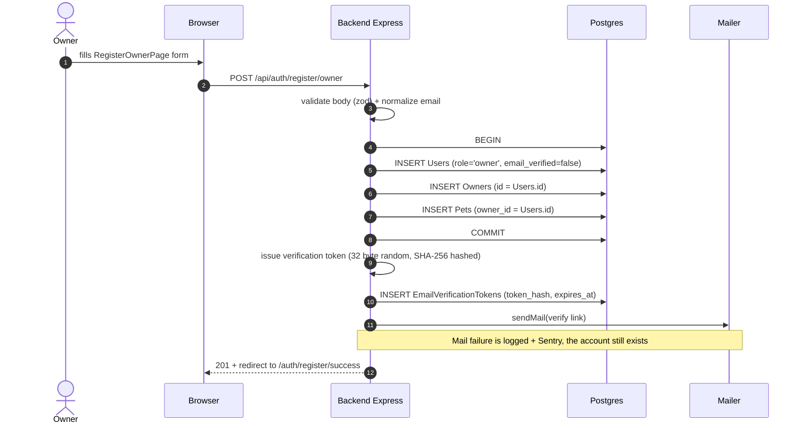

Doctor registration is structurally identical but additionally upserts `Specializations`, `Services`, `Doctor_Specializations`, `Specialization_Services`, and `Doctor_Service_Pricing` in the same transaction.

### 2.2 Email verification token state

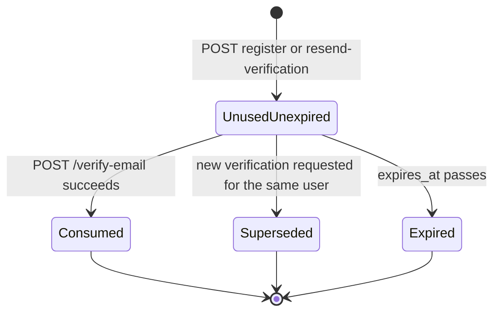

Implementation notes:

- The raw token travels in the email link only. The database stores `sha256(token)` in `EmailVerificationTokens.token_hash` so a database dump cannot be replayed against the live system.
- Issuing a new token deletes all rows where `user_id = $1 AND used_at IS NULL` (Superseded transition above), so only the most recent link is valid.
- `expires_at` defaults to `now() + EMAIL_VERIFICATION_EXPIRES_HOURS` (24 hours by default; see [`src/core/config/email.ts`](../healthy-paws-service/src/core/config/email.ts)).
- Verification runs as a single transaction that flips `Users.email_verified = TRUE`, sets `Users.email_verified_at = now()`, and marks `EmailVerificationTokens.used_at = now()`.

### 2.3 User-level verification flag

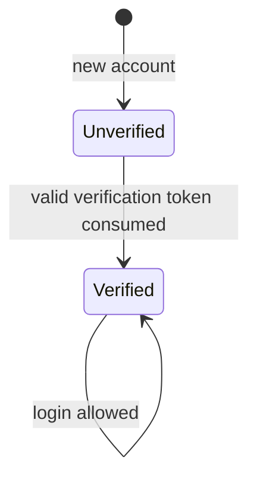

Migration `0003_email_verification.cjs` added the column with default `FALSE` and then back-filled all pre-existing rows to `TRUE` so legacy users were not locked out.

### 2.4 Login

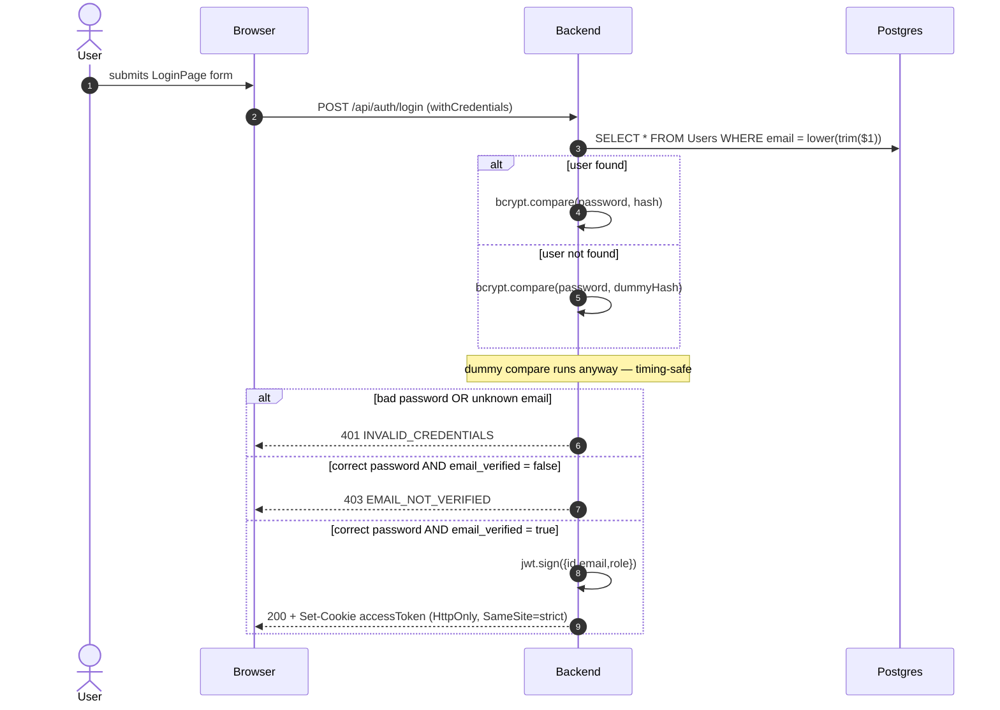

Unknown email and wrong password return the same message (`INVALID_CREDENTIALS`) so an attacker cannot enumerate accounts via login.

### 2.5 F-16 unverified login + resend

When the password is correct but `email_verified = false`, the backend returns HTTP 403 with the message `Please verify your email address before signing in.` (see [`healthy-paws-service/src/errors/constants.ts`](../healthy-paws-service/src/errors/constants.ts), `ClientErrorMessages.EMAIL_NOT_VERIFIED`).

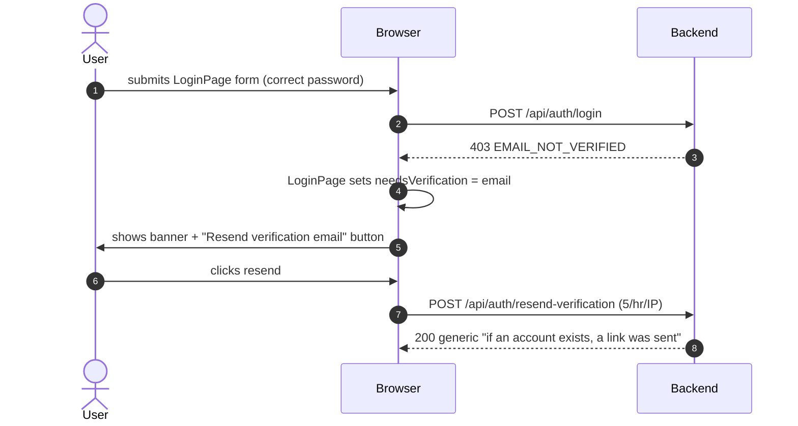

Resend always returns the same generic success message regardless of whether the email is unknown, already verified, or actually re-sent — preventing enumeration via the resend endpoint.

### 2.6 Registration is *not* enumeration-safe (known gap)

Registering with an email that already has an account returns HTTP 409 `ACCOUNT_EXISTS`. This intentionally trades enumeration safety for a clearer onboarding error message and is the only place in the auth surface that confirms or denies whether an email is registered.

### 2.7 Password reset

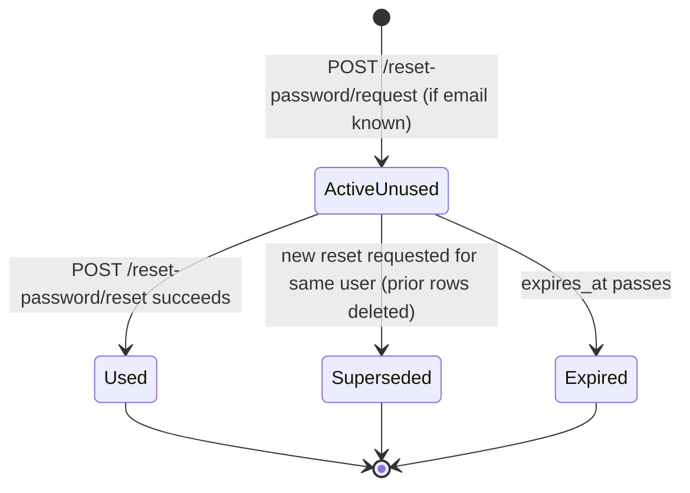

- Request endpoint always returns 200 with the same message whether the email exists or not (5 requests / hour / IP).
- Reset completion validates `token_hash = sha256(raw)`, `used = false`, `expires_at > now()`. Failure returns 400 `INVALID_RESET_TOKEN`.
- The new password is validated by the same Zod rule as registration: minimum 8 characters, at least one uppercase, one lowercase, one digit, one symbol.

### 2.8 Logout

`POST /api/auth/logout` clears the `accessToken` cookie. The frontend additionally calls `apolloClient.clearStore()` so cached owner / pet / appointment data is dropped before the user is sent back to `/`. The Apollo error link wires the same logout + redirect path on any `UNAUTHENTICATED` GraphQL error or HTTP 401, so a forcibly invalidated session lands the user on `/auth/login` rather than silently failing.

### 2.9 Rate limits across the auth surface

| Endpoint | Limit | Defined in |
|---|---|---|
| `POST /api/auth/login` | 10 / 15 min / IP | `loginLimiter` |
| `POST /api/auth/register/owner` and `/doctor` | 5 / hr / IP | `registrationLimiter` |
| `POST /api/auth/reset-password/request` | 5 / hr / IP | `sendCodeLimiter` |
| `POST /api/auth/reset-password/reset` | 10 / 15 min / IP | `resetLimiter` |
| `POST /api/auth/verify-email` | 10 / 15 min / IP | `resetLimiter` |
| `POST /api/auth/resend-verification` | 5 / hr / IP | `sendCodeLimiter` |

All limiters live in [`healthy-paws-service/src/core/middleware/rate-limit.ts`](../healthy-paws-service/src/core/middleware/rate-limit.ts) and key by `req.ip`, which is honoured via the `TRUST_PROXY` setting when the app sits behind a load balancer.

---

## 3. Owners and pets

Owners can only see and edit their own data. The rule is enforced in [`healthy-paws-service/src/core/utils/authorization.utils.ts`](../healthy-paws-service/src/core/utils/authorization.utils.ts):

- `verifyOwnerOwnership(userId, ownerId)` throws `FORBIDDEN` unless the IDs match. Applied to `owner(id)` and `updateOwnerProfile`.
- `verifyPetOwnership(userId, petId)` throws `FORBIDDEN` unless `Pets.owner_id = userId`. Applied to `pet(id)`, `createPet`, `updatePet`, and `createAppointment` (the owner must own the pet they are booking for).

Pets always belong to exactly one owner via `Pets.owner_id`. Deleting an owner cascades to their pets, which cascades to their health records and appointments.

Health-record uniqueness is enforced at the database level:

- `UNIQUE (pet_id, condition)` on `Health_Records_Lifelong`.
- `UNIQUE (pet_id, condition)` on `Health_Records_Active`.

If the doctor tries to add a duplicate condition through `updateAppointment`, the backend converts the Postgres uniqueness violation into HTTP 400 `CONDITION_ALREADY_EXISTS` so the UI can show a sensible error instead of a stack trace.

---

## 4. Doctors, specializations, services, availability

### 4.1 What appears in the catalog

The owner-facing doctor catalog (`Query doctors`) intentionally hides incomplete profiles: it only returns doctors that have at least one row in `Doctor_Specializations`. A newly-registered doctor without any specialization is invisible until they declare one.

Within that filter:

- Name search is case-insensitive `ILIKE` and matches either the doctor's name *or* the clinic name.
- `specializationId` filter joins through `Doctor_Specializations`.
- Results are paginated (`OFFSET` / `LIMIT`) and ordered by doctor name ascending.

### 4.2 Specializations, services, and prices

Three many-to-many relationships work together to express "what a doctor sells":

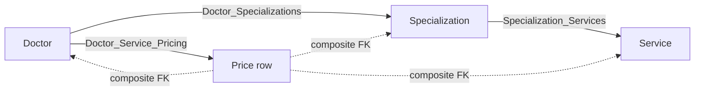

The `Doctor_Service_Pricing` row uses composite foreign keys that reference both `Doctor_Specializations(doctor_id, specialization_id)` and `Specialization_Services(specialization_id, service_id)`. The practical consequence is that you cannot price a service unless the doctor is actually linked to that specialization and that specialization is actually linked to that service — the catalog cannot become inconsistent through the API.

`Specializations.name` and `Services.name` are `UNIQUE`, so registration upserts global catalog rows by name rather than creating duplicates.

### 4.3 Availability slots

Doctors publish bookable instants in `Availabilities (doctor_id, available_datetime)`. The pair is `UNIQUE`, so a doctor cannot accidentally publish the same instant twice.

The owner-facing `Doctor.availabilities` field returns only slots where `available_datetime >= now()` ordered ascending — past slots are hidden by the resolver, not deleted from the table.

### 4.4 Who can edit what

All doctor-side mutations (`updateDoctorProfile`, `addDoctorSpecialization`, `removeDoctorSpecialization`, `updateDoctorSpecialization`, `addDoctorAvailability`, `removeDoctorAvailability`) are gated by `verifyDoctorOwnership(userId, doctorId)`, which requires the JWT subject to equal the `doctorId` argument. A doctor cannot edit another doctor's profile.

---

## 5. Appointment lifecycle

Appointments are the heart of Healthy Paws. The status of an appointment is a Postgres enum (`AppointmentStatus`) with seven labels: `Pending`, `Confirmed`, `Upcoming`, `Start`, `Completed`, `Denied`, `Cancelled`. The enum constrains the *set* of allowed values; the application code controls when each transition fires.

### 5.1 Stored status machine

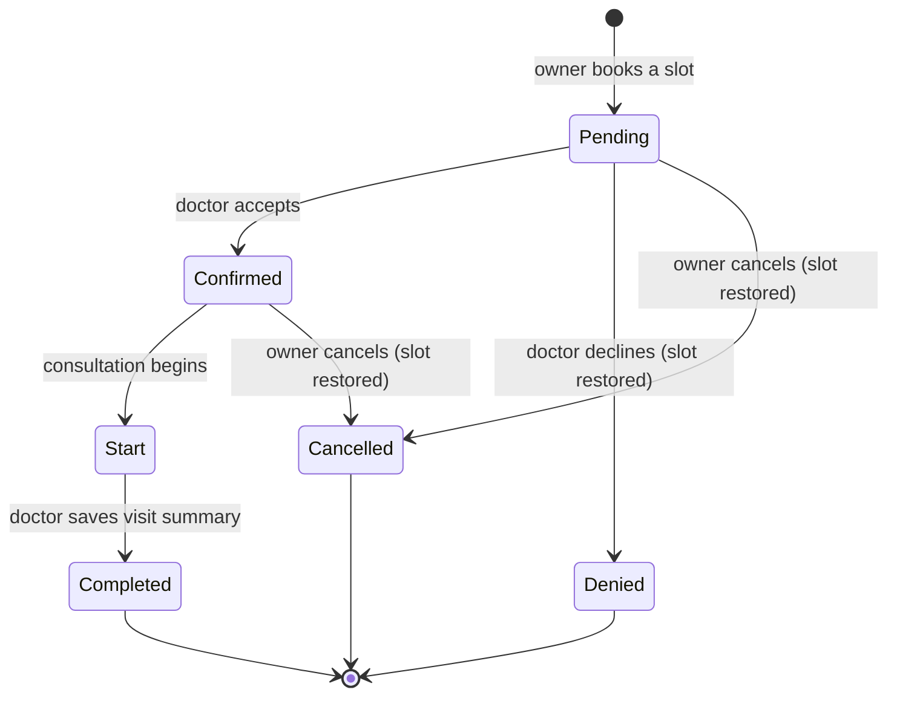

Two things are worth knowing:

- The `Upcoming` enum value also exists, but in practice the stored status stays `Confirmed`. The frontend's `getAppointmentDisplayStatus` helper renders a `Confirmed` appointment as `Upcoming` when the start time is within the next two hours; the DB row is not mutated.
- There is no application-level legality matrix for arbitrary transitions — the backend will accept any enum value passed through `updateAppointment` as long as ownership checks pass. The flow above reflects what the UI actually exercises.

### 5.2 Owner books a slot

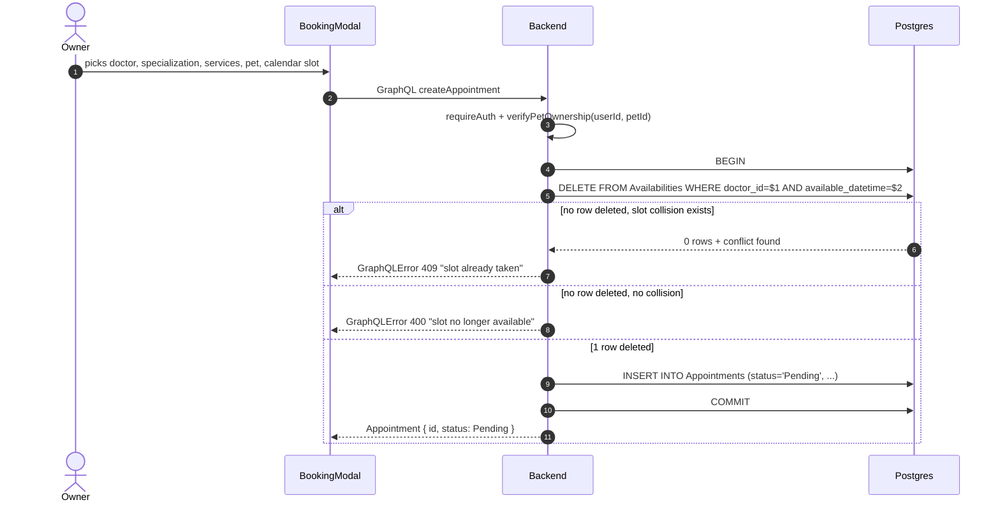

The `status` field of `CreateAppointmentInput` is intentionally ignored — new rows always start as `Pending` so a malicious client cannot pre-confirm.

The partial unique index `unq_doctor_appointment_active ON Appointments (doctor_id, appointment_datetime) WHERE status NOT IN ('Cancelled','Denied')` is the database's belt-and-braces guarantee: even under concurrent inserts, only one non-terminal appointment can exist for a given doctor at a given instant.

### 5.3 Doctor accepts or declines

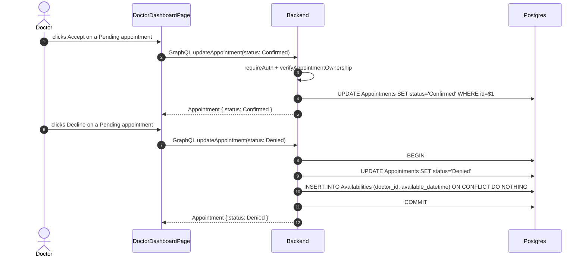

`Cancelled` works the same way as `Denied`: when the appointment was previously in an active status, the original slot is re-inserted into `Availabilities` so the doctor's calendar reflects the free time again.

### 5.4 Doctor runs the consultation

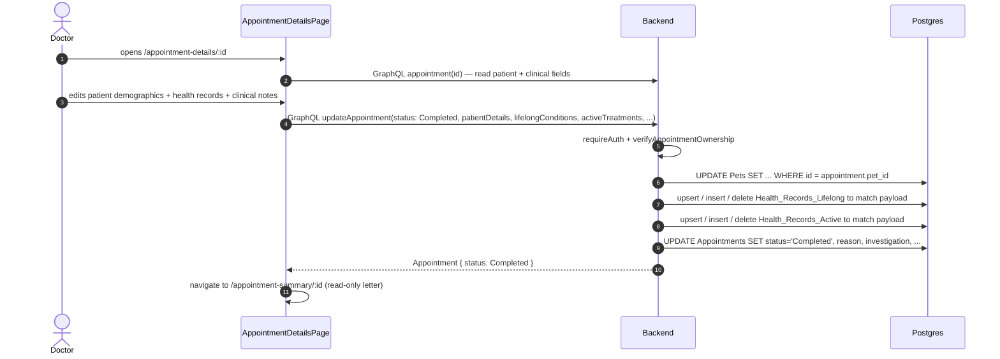

Health-record sync is set-shaped: the payload is treated as the authoritative list. Existing rows with an `id` in the payload are updated; rows with new entries are inserted; rows whose `id` is missing from the payload are deleted. Uniqueness on `(pet_id, condition)` produces the user-visible 400 `CONDITION_ALREADY_EXISTS` error described in section 3.

---

## 6. "Doctor can see a patient only after a completed consultation"

This is the rule the project description leads with, so it deserves its own section.

### 6.1 How the rule is encoded

The rule is enforced in two places, both of which must agree:

1. **Backend** — `getPatientsByDoctor` in [`healthy-paws-service/src/features/doctors/doctors.loaders.ts`](../healthy-paws-service/src/features/doctors/doctors.loaders.ts) issues `SELECT DISTINCT pets.* FROM Pets JOIN Appointments ON pets.id = appointments.pet_id WHERE appointments.doctor_id = $1 AND appointments.status = 'Completed'`. A doctor's `patients` field is, by construction, only the set of pets they have already completed a visit with.
2. **Frontend** — `DoctorDashboardPage` ([`healty-paws-frontend/src/pages/dashboard/doctor/DoctorDashboardPage.tsx`](../healty-paws-frontend/src/pages/dashboard/doctor/DoctorDashboardPage.tsx)) builds `completedPatientIds` from its local list of appointments where `status === "Completed"` and further filters `doctor.patients` against that set. This belt-and-braces filter survives stale Apollo cache and would also catch a backend regression that started leaking pets.

### 6.2 Flow when a doctor opens "My Patients"

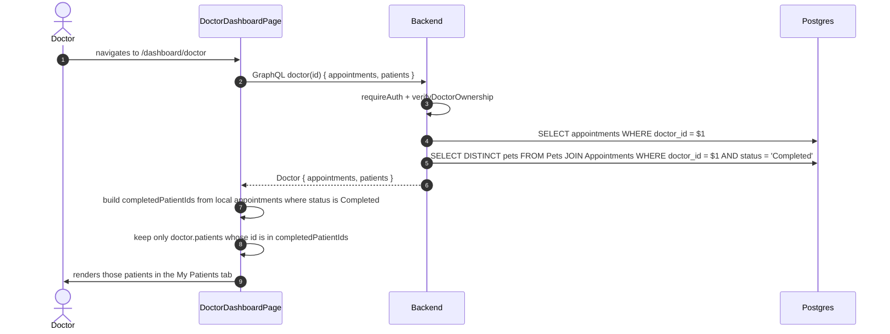

### 6.3 Honest limitation

Once a pet appears in `Doctor.patients`, the nested `Pet.appointments` resolver currently returns *all* appointments for that pet, not only those with the requesting doctor. In practice this rarely matters (most pets only see one clinic), but it is a real scope leak that a stricter implementation would close by scoping pet appointments to the request's doctor when the parent path was `Doctor → patients → Pet`. It is documented here rather than hidden so an evaluator can ask the right follow-up question.

---

## 7. Audit trail

Every meaningful security-relevant event is written to `AuditEvents`. The table is append-only by convention (no UPDATE / DELETE paths in the codebase) and the `outcome` column is constrained to `('success', 'failure', 'denied')`.

Writers:

- REST controllers for auth (login success, login failure, login denied with `reason: email_not_verified`, logout, password reset request, password reset complete, email verify request, email verify complete).
- Apollo plugin `auditMutations` records `mutation.success`, `mutation.failure`, and `authz.deny` for every GraphQL mutation, tagged with the operation name and the error code if any. Queries are not audited.

Writes go through `AuditService.record`, which is fire-and-forget — a database error while inserting an audit row is logged + reported to Sentry but never breaks the user-facing request.

---

## 8. What is not wired up yet

These are user-visible gaps that the deployment work in [`.cursor/plans/simple_aws_deploy_b6a51c00.plan.md`](.cursor/plans/simple_aws_deploy_b6a51c00.plan.md) will close. The matching technical tasks are tracked in `ARCHITECTURE.md` section 12.

- **In progress** — Persistent avatar uploads. Today the user's avatar is a base64 data URL stored in `localStorage` under `avatar-${role}-${userId}` (see [`healty-paws-frontend/src/components/ui/AvatarImage`](../healty-paws-frontend/src/components/ui/AvatarImage)). Avatars therefore do not survive a different browser, an incognito session, or another device. The plan's step `s05` (backend storage module) and `s10` (S3 bucket) make this persistent.
- **In progress** — Public hosting on a real domain. The app currently runs only on `localhost` through Docker Compose. Plan steps `s06`–`s20` cover the AWS account, the EC2 box, the Cloudflare-managed domain and TLS, the Resend production sending domain, and the first production deploy.

Both items are tracked separately in [`ARCHITECTURE.md`](ARCHITECTURE.md) under "Production deployment topology" and "In progress" so the technical breakdown lives next to the deployment plan it references.
